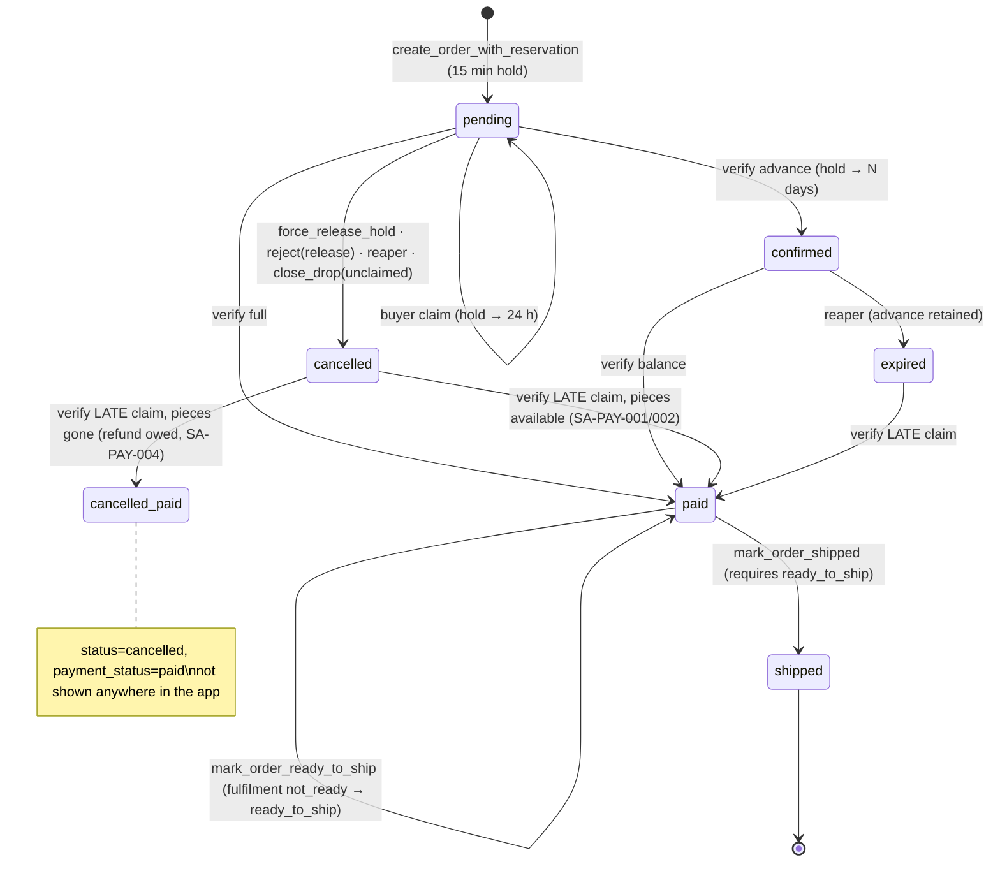

# 09 — Order Management / Kanban / Fulfilment Audit (+ Analytics and Settings)

| | |
|---|---|
| Audited commit | `94ccfc9` |
| Date | 2026-10-03 |
| Scope | Order state machine (derived from migrations, RPCs, seller UI, buyer UI, tests), Kanban, order details, analytics, seller configuration (brief sections 12, 18-analytics, 19) |
| Executed | SQL suites 12, 13, 14, 16, 17; Flutter T01–T05, T20, T21; code trace |
| Not executed | Device runs; hosted data |

## 1. Derived state machine (authoritative = SQL)

| Dimension | Values | Enforced by |
|---|---|---|
| `orders.status` | pending, confirmed, paid, shipped, cancelled, expired | RPCs + `enforce_orders_payment_immutability` (direct lifecycle UPDATE blocked, 12.10b) |
| `payment_status` | unpaid, advance_paid, paid | RPCs; CHECK `chk_orders_balance_formula`, `chk_orders_paid_lifecycle` |
| `fulfilment_status` | not_ready, ready_to_ship, shipped | 026 RPCs; CHECK `chk_orders_shipment_requires_full_payment` |
| Attempt status | created, awaiting_payment, buyer_claimed, awaiting_seller_verification, late_claim_pending_review, verified, rejected, expired | 013/023 RPCs, reaper |
| Not modelled | **packed** (only as `ready_to_ship` + `packed_at`), **delivered**, **refunded**, **rejected** (as an order state) | — |

## 2. Transition tests

| Test | Result | Evidence |
|---|---|---|
| Double ship | `ALREADY_SHIPPED` — PASS | 12.8c |
| Ship unpaid / not ready | `ORDER_NOT_PAID` / `ORDER_NOT_READY_TO_SHIP` — PASS | 12.8b |
| Ready on unpaid | `ORDER_NOT_PAID` — PASS | 12.8b |
| Double verify | Idempotent, one ledger row — PASS | 13.1c |
| Direct lifecycle UPDATE by seller | Blocked (42501) — PASS; `shipping_address` editable directly (intended, no audit trail) | 12.10/12.10b |
| Backward transitions | Only via late-claim verification (cancelled/expired → paid) — by design, but racy and wrong for advances | 13.5, 14.2 |
| Concurrent seller actions (two devices verify) | Row lock + idempotency — PASS by design | 13.1c |
| Release while a claim is in flight | Order cancelled, claim unverifiable | 16.1 FINDING (SA-PAY-005) |
| Seller deletes order with ledger | Allowed for cancelled+paid (refund owed) | 17.1 FINDING (SA-PAY-018) |
| Stale UI | Tabs never refresh on focus; realtime only with a selected drop | SA-CQ-001, SA-RT-001 |
| Realtime update race | Each event triggers an independent full refetch; responses can arrive out of order and an older list can overwrite a newer one (no request sequencing) | INFERRED (SA-RT-002) |
| Order reload | Pull to refresh / refresh icon | — |
| Network failure mid-dispatch | Ready succeeds, ship fails → order lands in Ready tab; retry works | Code (`shipping_dialog.dart:126-135`) |

## 3. Does the UI represent database truth?

| UI element | Rule in code | Truth gap |
|---|---|---|
| Pending tab | `status == pending` | Claimed (paid, awaiting verification) and unclaimed orders look the same; "Release" offered on both (SA-PAY-005) |
| Paid tab | `paid` OR `confirmed` OR `advance_paid`, not ready/shipped | Balance-due orders mixed with fully paid; Dispatch/label offered (T21, SA-ORD-005) |
| Ready tab | `fulfilment_status == ready_to_ship` | Reached only transiently (dispatch chains ready+ship) |
| Shipped tab | `shipped` | OK |
| Cancelled / expired / refund owed | **Not shown** | T20 (SA-ORD-004, SA-PAY-004) |
| Status pill | Paid / Advance Paid / Shipped / else "Payment Pending" | No "Claim submitted", "Late claim", "Refund owed" |
| Times | `DateFormat('hh:mm a')` on UTC | 5 h 30 min off (T04/T05, SA-ORD-001) |
| Order details | Initials crash on double spaces; "Mark as Ready" opens dispatch | T01, T03 |
| Contact buyer | WhatsApp country-code bug | T02 (SA-ORD-002) |
| Countdown | Per-card 1 s `Timer.periodic` while pending | Fine for tens of cards; hundreds of pending cards → many timers (perf note) |

## 4. Fulfilment-adjacent actions
- **Balance collection**: no seller action to request the balance of an advance order (SA-ORD-006); expired advance orders vanish from view.
- **Packing**: no separate pack step; `packed_at` is set at dispatch time.
- **Delivery/returns/refunds**: not modelled (future features; refunds are needed now for late claims — SA-PAY-004).

## 5. Analytics (brief section 18)
`getSellerAnalytics` downloads every order and computes in Dart (`seller_repository.dart:891-1014`):
- Revenue = paid/shipped orders only, `total_paid_paisa` or `total_paisa` → advance money excluded; late-claim inflated totals included (SA-PAY-001); refunds owed ignored.
- "Today"/daily bars are UTC days (start 05:30 IST).
- Active holds = items in pending/confirmed orders (includes expired-but-unreaped holds, SA-OPS-001).
→ SA-ANL-001. Recommendation: ledger-based SQL aggregates in IST; show "cash received", "to collect", "refunds owed".

## 6. Settings / seller configuration (brief section 19)

| Area | Implementation | Validation / persistence | Change while buyers/orders/claims are active |
|---|---|---|---|
| Boutique info (name, phone, address) | `updateProfile` | No client validators; DB CHECKs (phone regex, lengths) → raw errors | Storefront updates immediately; labels use the new return address |
| Storefront | Shows/share `getStorefrontUrl(store_slug)` | Slug not editable in app | Slug can be rewritten by anyone via SA-SEC-001 |
| UPI | Payment settings: enable toggle, VPA regex, display name, instructions | Server CHECK on VPA; **no re-auth** (SA-AUTH-004) | Existing attempts keep `payee_vpa_snapshot` (good); disabling UPI mid-live still lets buyers reserve (SA-PAY-012) |
| Advance payment | Toggle + amount (₹) | Silent fallback to ₹250 on parse failure (SA-SET-001) | Existing orders keep `advance_required_paisa` snapshot (good) |
| Payment instructions | Free text | — | Shown on new payment views |
| Shipping | Default fee (₹) | Silent fallback to ₹80 (SA-SET-001); **profile free-shipping threshold (default ₹2,000) not editable** although the server uses it | New orders only |
| Notifications | Three toggles | Local booleans, no effect (SA-NOT-001) | — |
| Account | Seller ID, slug, phone, "Active Verified Boutique" (hard-coded) | — | SA-ONB-004 |
| Support | WhatsApp to admin | — | — |
| Logout | Confirmation dialog → `signOut` | Local queue retained | Pushed routes not cleared (SA-AUTH-005) |

## 7. Findings
| ID | Sev | Pri | Summary |
|---|---|---|---|
| SA-ORD-001 | MEDIUM | P1 | UTC times on cards/labels/analytics |
| SA-ORD-002 | MEDIUM | P1 | WhatsApp drops +91 for numbers starting 91 |
| SA-ORD-003 | MEDIUM | P1 | Order screen crashes on double-space names |
| SA-ORD-004 | MEDIUM | P1 | Cancelled/expired/refund-owed orders hidden |
| SA-ORD-005 | MEDIUM | P1 | UI actions do not match server state machine |
| SA-ORD-006 | MEDIUM | P2 | No balance-collection tool |
| SA-ANL-001 | MEDIUM | P2 | Analytics not ledger-based, UTC days |
| SA-SET-001 | MEDIUM | P2 | Silent fee fallbacks; threshold not editable |
| SA-PAY-005 | HIGH | P0 | Release cancels orders with a claim in flight |
| SA-PAY-018 | MEDIUM | P1 | Refund-owed ledger deletable via order delete |
