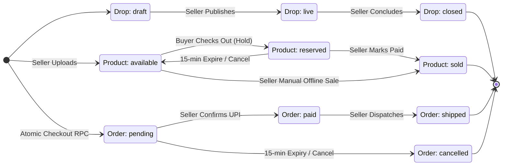

# 09 — System State Machines & Lifecycles: LiveDrop

**Document Version:** 1.0.0  
**Effective Date:** 2026-09-11  
**Status:** Authoritative Baseline  
**Governing Document:** [`docs/SOURCE-OF-TRUTH.md`](file:///c:/LiveDrop/docs/SOURCE-OF-TRUTH.md)  
**Parent Technical Design:** [`docs/04-technical-design.md`](file:///c:/LiveDrop/docs/04-technical-design.md)  

---

## 1. System State Transition Overview

The LiveDrop architecture is governed by three primary interconnected state machines:
1. **Drop Lifecycle:** `draft` ➔ `live` ➔ `closed`
2. **Product Inventory Lifecycle:** `available` ⇄ `reserved` ➔ `sold`
3. **Order Fulfillment Lifecycle:** `pending` ➔ `paid` ➔ `shipped` (or `cancelled`/`expired`)



---

## 2. Drop State Machine

```
   ┌─────────┐      Seller Publishes Drop       ┌─────────┐
   │  DRAFT  │ ───────────────────────────────► │  LIVE   │
   └─────────┘                                  └────┬────┘
                                                     │ Seller Concludes
                                                     ▼
                                                ┌─────────┐
                                                │ CLOSED  │
                                                └─────────┘
```

### 2.1 Drop State Transition Table

| State From | State To | Actor | Trigger | Preconditions | Database Mutation | Realtime Event | UI Behavior | Rollback / Error Mode |
|---|---|---|---|---|---|---|---|---|
| `[*] ` | `draft` | Seller | Seller creates new session | Seller authenticated | `INSERT INTO drops (status='draft')` | None | Drops list displays draft card | Transaction rollback |
| `draft` | `live` | Seller | Tap "Go Live" | Drop has ≥1 product; seller has no other `live` drop | `UPDATE drops SET status='live', live_started_at=NOW()` | `drop_status:live` | Catalog link becomes publicly accessible | Abort if active live drop already exists |
| `live` | `closed` | Seller | Tap "End Live Drop" | Drop is `live` | `UPDATE drops SET status='closed', closed_at=NOW()` | `drop_status:closed` | Catalog shows "Broadcast concluded" | Unaffected; existing pending orders remain valid |

### 2.2 Illegal Drop Transitions
* `closed` ➔ `live`: **Strictly Forbidden**. Drops cannot be reopened. Seller must create a new drop to prevent cross-stream inventory confusion.
* `closed` ➔ `draft`: **Strictly Forbidden**.
* `draft` ➔ `closed`: **Forbidden**. Must transition through `live` or be deleted if empty.

---

## 3. Product Inventory State Machine

```
                    ┌───────────────┐
                    │   available   │ ◄────────────────────────┐
                    └───────┬───────┘                          │
                            │                                  │
      Buyer Order Checkout  │         Seller Offline Sale      │ 15-min Hold Expiry /
      (Atomic RPC Locks)    │        (Manual Long-Press)       │ Buyer/Seller Cancel
                            ▼                                  │
                    ┌───────────────┐                          │
                    │   reserved    │ ─────────────────────────┘
                    └───────┬───────┘
                            │ Seller Marks Order "Paid"
                            ▼
                    ┌───────────────┐
                    │     sold      │ (Terminal State)
                    └───────────────┘
```

### 3.1 Product State Transition Table

| State From | State To | Actor | Trigger | Preconditions | Database Mutation | Realtime Broadcast | UI Behavior | Rollback / Failure Recovery |
|---|---|---|---|---|---|---|---|---|
| `[*] ` | `available` | Seller | Camera ingestion upload | Drop in `draft` or `live` | `INSERT INTO products (status='available')` | `product:created` | Appends tile to seller grid and live catalog | Image deleted from storage if insert fails |
| `available` | `reserved` | Buyer | Tap "Confirm & Order via WhatsApp" | Product is `available`, drop is `live` | `UPDATE products SET status='reserved', reserved_at=NOW(), reserved_by_order_id=v_order.id, version=version+1` | `product:updated (reserved)` | Buyer web shows amber badge + timer; cart locks items | Transaction rolls back if row lock fails |
| `reserved` | `available` | System (Cron) | Hold timer exceeds 15 mins | Order is `pending`, `hold_expires_at < NOW()` | `UPDATE products SET status='available', reserved_at=NULL, reserved_by_order_id=NULL, version=version+1` | `product:updated (available)` | Catalog pill switches back to green `Available` | Idempotent; skips if already sold |
| `reserved` | `available` | Seller | Seller taps "Cancel / Release Hold" | Seller owns drop | `UPDATE products SET status='available', reserved_at=NULL, reserved_by_order_id=NULL, version=version+1` | `product:updated (available)` | Order moves to cancelled; item freed | Rollback on DB error |
| `reserved` | `sold` | Seller | Seller taps "Mark as Paid" | Order in `pending`, products not claimed by other orders | `UPDATE products SET status='sold', version=version+1` | `product:updated (sold)` | Catalog displays grey `Sold Out` badge; disabled | Rejects with `PRODUCT_ALREADY_RECLAIMED` if stolen |
| `available` | `sold` | Seller | Manual long-press "Mark Sold Offline" | Product in `available` | `UPDATE products SET status='sold', version=version+1` | `product:updated (sold)` | Live dashboard reflects instant offline sale | Rollback on DB error |

### 3.2 Illegal Product Transitions
* `sold` ➔ `available`: **Forbidden in MVP**. Prevents accidental relisting of packed goods.
* `sold` ➔ `reserved`: **Strictly Forbidden**.
* `available` ➔ `reserved` via direct REST: **Forbidden**. Only callable via `create_order_with_reservation` RPC.

---

## 4. Order Fulfillment State Machine

```
         Buyer Submits Web Cart
                   │
                   ▼
            ┌─────────────┐
            │   PENDING   │ ──── 15-Minute Expiration / Cancel ────► ┌─────────────┐
            └──────┬──────┘                                          │  CANCELLED  │
                   │ Seller Verifies UPI                             └─────────────┘
                   ▼
            ┌─────────────┐
            │    PAID     │
            └──────┬──────┘
                   │ Seller Dispatches Parcel
                   ▼
            ┌─────────────┐
            │   SHIPPED   │ (Terminal State)
            └─────────────┘
```

### 4.1 Order State Transition Table

| State From | State To | Actor | Trigger | Preconditions | Database Mutation | Realtime Event | UI Behavior | Rollback / Error Recovery |
|---|---|---|---|---|---|---|---|---|
| `[*] ` | `pending` | Buyer | Atomic checkout RPC | Cart items available | `INSERT INTO orders (status='pending', hold_expires_at=NOW()+15m)` | `order:created` | Order appears in seller Kanban "Pending" tab | Transaction rolls back on stock contention |
| `pending` | `paid` | Seller | Tap "Mark as Paid" | Items not claimed by other orders | `UPDATE orders SET status='paid', paid_at=NOW()`; products ➔ `sold` | `order:updated (paid)` | Order moves to "Ready to Pack" tab; label button active | Aborts if items claimed after expiry |
| `pending` | `cancelled` | System (Cron) | `hold_expires_at < NOW()` | Order was `pending` | `UPDATE orders SET status='cancelled'` | `order:updated (cancelled)` | Order marked expired in seller board | Idempotent execution |
| `pending` | `cancelled` | Seller | Tap "Cancel Hold" | Order in `pending` | `UPDATE orders SET status='cancelled'`; products ➔ `available` | `order:updated (cancelled)` | Order cleared from pending | Rollback on DB error |
| `paid` | `shipped` | Seller | Enter tracking number & tap "Dispatched" | Order is `paid`, tracking non-empty | `UPDATE orders SET status='shipped', shipped_at=NOW(), tracking_number=...` | `order:updated (shipped)` | Order archived into "Dispatched" tab | Rollback on DB error |

---

## 5. Critical Edge Condition Resolution: Seller Marking Expired Order Paid

### The Failure Scenario
1. Buyer A orders Dress `#A01` at 8:00 PM. Hold expires at 8:15 PM.
2. Buyer A sends UPI payment screenshot at 8:14 PM.
3. Seller is busy presenting live and does not check WhatsApp until 8:20 PM.
4. At 8:15 PM, the database cron executes `release_expired_holds()`, resetting `#A01` to `available` and Order A to `cancelled`.
5. At 8:18 PM, Buyer B orders `#A01` via the web catalog.
6. At 8:20 PM, Seller views Buyer A's screenshot and taps "Mark as Paid" on Order A.

### Reconciled Authoritative Resolution
The `mark_order_paid(p_order_id)` RPC executes an atomic validation check:
```sql
SELECT COUNT(*) INTO v_contested_count
FROM products p
JOIN order_items oi ON oi.product_id = p.id
WHERE oi.order_id = p_order_id
  AND (p.status = 'sold' OR (p.status = 'reserved' AND p.reserved_by_order_id != p_order_id));

IF v_contested_count > 0 THEN
    RETURN jsonb_build_object(
        'success', false, 
        'error', 'PRODUCT_ALREADY_RECLAIMED',
        'message', 'One or more items in this order were claimed by another buyer after the hold expired.'
    );
END IF;
```

* **If Contested:** The transaction strictly aborts. The seller app shows a high-priority warning dialog: *"Conflict: Item #A01 was reserved by another customer after this order expired. You must either refund Buyer A or contact Buyer B."*
* **If Not Contested (Item still available):** The RPC re-acquires the lock, updates the products to `sold`, sets Order A status to `paid`, and succeeds seamlessly.
