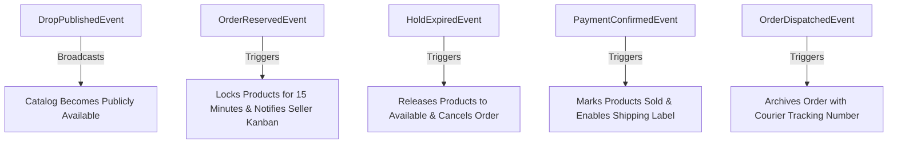

# 10 — Domain Model & Ubiquitous Language: LiveDrop

**Document Version:** 1.0.0  
**Effective Date:** 2026-09-11  
**Status:** Authoritative Baseline  
**Governing Document:** [`docs/SOURCE-OF-TRUTH.md`](file:///c:/LiveDrop/docs/SOURCE-OF-TRUTH.md)  
**Parent Technical Design:** [`docs/04-technical-design.md`](file:///c:/LiveDrop/docs/04-technical-design.md)  

---

## 1. Ubiquitous Language

| Term | Definition & Domain Boundary |
|---|---|
| **Boutique / Seller** | An independent entrepreneur broadcasting garment collections on social media and fulfilling orders. |
| **Drop** | A discrete live selling broadcast session containing a curated collection of products with an active public link. |
| **Flash Code** | A short, high-contrast alphanumeric tag (e.g., `#A01`, `#12`) shown physically on camera and displayed on the web catalog. |
| **Single-Piece Garment** | An inventory item with `quantity = 1`. Represents a unique physical garment (saree, kurti, dress). |
| **Reservation / Hold** | A temporary 15-minute exclusive lock placed on one or more garments while a buyer coordinates payment over WhatsApp. |
| **Cart Bundle** | Multiple garments selected by a single buyer across a live broadcast combined into one order and single shipment. |
| **WhatsApp Handshake** | The buyer-to-seller communication channel initiated via a pre-filled `wa.me` deep link for payment and confirmation. |
| **Static UPI QR / VPA** | The seller's direct Virtual Payment Address (e.g., `store@okaxis`) used for peer-to-peer 0% fee payments. |
| **Shipping Slip / Label** | A standardized 4×6 inch thermal PDF label containing recipient address, sender details, flash codes, and barcode. |

---

## 2. Bounded Contexts

```
┌─────────────────────────────────────────────────────────────────────────────┐
│                              LIVEDROP DOMAIN                                │
├───────────────────────────┬───────────────────────────┬─────────────────────┤
│ 1. Catalog & Ingestion    │ 2. Order & Reservation    │ 3. Fulfillment &    │
│    Context                │    Context                │    Dispatch Context │
├───────────────────────────┼───────────────────────────┼─────────────────────┤
│ • Drop Management         │ • Atomic Stock Hold       │ • Payment Verify    │
│ • Rapid Camera Capture    │ • Multi-Item Cart Bundle  │ • 4x6 Label Render  │
│ • Flash Code Generation   │ • WhatsApp Deep-Link      │ • Courier Tracking  │
│ • Realtime Catalog Sync   │ • Expiration Reaper       │ • Parcel Manifest   │
└───────────────────────────┴───────────────────────────┴─────────────────────┘
```

---

## 3. Aggregate Roots, Entities & Value Objects

### 3.1 Drop Aggregate
* **Aggregate Root:** `Drop`
* **Entities:** `Product`
* **Value Objects:**
  * `DropSlug` (URL-safe unique identifier)
  * `DropStatus` (`draft`, `live`, `closed`)
  * `FlashCode` (`#` followed by 1–4 uppercase alphanumeric characters)
  * `Money` (Currency `INR`, non-negative numeric amount)
  * `ProductStatus` (`available`, `reserved`, `sold`)
* **Invariants:**
  * A seller may have only **one** Drop in `live` status at any given time.
  * Flash Codes must be strictly unique within a single Drop (`UNIQUE(drop_id, code)`).
  * A Product cannot be reserved or sold unless its parent Drop is in `live` status.

### 3.2 Order Aggregate
* **Aggregate Root:** `Order`
* **Entities:** `OrderItem`
* **Value Objects:**
  * `OrderCode` (Randomized, user-facing code, e.g. `LD-7K92`)
  * `OrderToken` (Cryptographically secure UUIDv4 for unauthenticated receipt access)
  * `OrderStatus` (`pending`, `paid`, `shipped`, `cancelled`)
  * `BuyerContact` (Full Name, 10-digit Indian mobile number)
  * `DeliveryAddress` (Multiline street address, 6-digit Indian pincode)
  * `TrackingInfo` (Courier Partner name, Tracking / AWB number)
* **Invariants:**
  * An Order must contain at least **one** OrderItem.
  * `total_amount` must exactly equal `subtotal_amount + shipping_amount`.
  * `subtotal_amount` is immutable and derived strictly from database product prices at purchase.
  * An Order in `paid` status can never return to `pending` or `cancelled`.

### 3.3 Seller Profile Aggregate
* **Aggregate Root:** `Profile`
* **Value Objects:**
  * `StoreName`
  * `SellerPhone` (Normalized E.164 without `+`)
  * `UpiId` (Valid NPCI Virtual Payment Address)
  * `ReturnAddress`
  * `ShippingPolicy` (Default shipping fee, Free shipping threshold)

---

## 4. Domain Events



1. **`DropPublishedEvent`:** Fired when a seller toggles a drop from `draft` to `live`. Emits Realtime notification making the public catalog discoverable.
2. **`OrderReservedEvent`:** Fired by `create_order_with_reservation`. Atomically locks products and pushes the order to the seller's Kanban "Pending" tab.
3. **`HoldExpiredEvent`:** Fired by `release_expired_holds` when an order exceeds 15 minutes without payment. Releases inventory back to the catalog feed.
4. **`PaymentConfirmedEvent`:** Fired by `mark_order_paid`. Moves products to terminal `sold` state and moves the order to "Ready to Pack".
5. **`OrderDispatchedEvent`:** Fired when tracking number is attached and order transitions to `shipped`.
