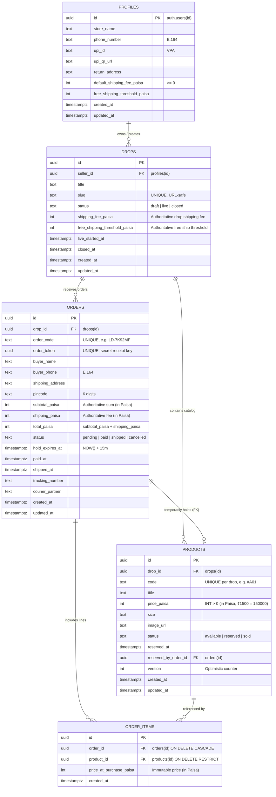

# 12 — Database Design & Transaction Architecture: LiveDrop

**Document Version:** 1.0.0  
**Effective Date:** 2026-09-11  
**Status:** Authoritative Baseline  
**Governing Document:** [`docs/SOURCE-OF-TRUTH.md`](file:///c:/LiveDrop/docs/SOURCE-OF-TRUTH.md)  
**Parent Technical Design:** [`docs/04-technical-design.md`](file:///c:/LiveDrop/docs/04-technical-design.md)  
**Data Dictionary:** [`docs/11-data-dictionary.md`](file:///c:/LiveDrop/docs/11-data-dictionary.md)  

---

## 1. Conceptual & Logical ER Diagram



---

## 2. Complete Reconciled Physical Schema (DDL)

```sql
-- LiveDrop Production Schema v2.0.0 (Hardened)
-- Database: PostgreSQL 15+ (Supabase)
-- Currency Standard: Integer Paisa (INR * 100) per ADR-009 & AGENTS.md

BEGIN;

CREATE EXTENSION IF NOT EXISTS "uuid-ossp";

-- ============================================================================
-- 1. TABLE: profiles
-- ============================================================================
CREATE TABLE profiles (
    id UUID PRIMARY KEY REFERENCES auth.users(id) ON DELETE CASCADE,
    store_name TEXT NOT NULL CHECK (char_length(store_name) BETWEEN 2 AND 100),
    phone_number TEXT NOT NULL CHECK (phone_number ~ '^[6-9]\d{9}$' OR phone_number ~ '^91[6-9]\d{9}$'),
    upi_id TEXT NOT NULL CHECK (upi_id ~ '^[a-zA-Z0-9.\-_]{2,256}@[a-zA-Z]{2,64}$'),
    upi_qr_url TEXT,
    return_address TEXT NOT NULL CHECK (char_length(return_address) BETWEEN 10 AND 500),
    default_shipping_fee_paisa INT NOT NULL DEFAULT 8000 CHECK (default_shipping_fee_paisa >= 0),
    free_shipping_threshold_paisa INT DEFAULT 200000 CHECK (free_shipping_threshold_paisa >= 0),
    created_at TIMESTAMPTZ NOT NULL DEFAULT NOW(),
    updated_at TIMESTAMPTZ NOT NULL DEFAULT NOW()
);

-- ============================================================================
-- 2. TABLE: drops
-- ============================================================================
CREATE TABLE drops (
    id UUID PRIMARY KEY DEFAULT gen_random_uuid(),
    seller_id UUID NOT NULL REFERENCES profiles(id) ON DELETE CASCADE,
    title TEXT NOT NULL CHECK (char_length(title) BETWEEN 3 AND 150),
    slug TEXT UNIQUE NOT NULL CHECK (slug ~ '^[a-z0-9]+(?:-[a-z0-9]+)*$'),
    status TEXT NOT NULL CHECK (status IN ('draft', 'live', 'closed')) DEFAULT 'draft',
    shipping_fee_paisa INT NOT NULL DEFAULT 8000 CHECK (shipping_fee_paisa >= 0),
    free_shipping_threshold_paisa INT DEFAULT 200000 CHECK (free_shipping_threshold_paisa >= 0),
    live_started_at TIMESTAMPTZ,
    closed_at TIMESTAMPTZ,
    created_at TIMESTAMPTZ NOT NULL DEFAULT NOW(),
    updated_at TIMESTAMPTZ NOT NULL DEFAULT NOW()
);

-- ============================================================================
-- 3. TABLE: products
-- ============================================================================
CREATE TABLE products (
    id UUID PRIMARY KEY DEFAULT gen_random_uuid(),
    drop_id UUID NOT NULL REFERENCES drops(id) ON DELETE CASCADE,
    code TEXT NOT NULL CHECK (code ~ '^#[A-Z0-9]{1,6}$'),
    title TEXT CHECK (char_length(title) <= 100),
    price_paisa INT NOT NULL CHECK (price_paisa > 0),
    size TEXT CHECK (char_length(size) <= 30),
    image_url TEXT NOT NULL,
    status TEXT NOT NULL CHECK (status IN ('available', 'reserved', 'sold')) DEFAULT 'available',
    reserved_at TIMESTAMPTZ,
    reserved_by_order_id UUID, -- Foreign key established below
    version INT NOT NULL DEFAULT 1 CHECK (version >= 1),
    created_at TIMESTAMPTZ NOT NULL DEFAULT NOW(),
    updated_at TIMESTAMPTZ NOT NULL DEFAULT NOW(),
    UNIQUE(drop_id, code)
);

-- ============================================================================
-- 4. TABLE: orders
-- ============================================================================
CREATE TABLE orders (
    id UUID PRIMARY KEY DEFAULT gen_random_uuid(),
    drop_id UUID NOT NULL REFERENCES drops(id) ON DELETE RESTRICT,
    order_code TEXT UNIQUE NOT NULL CHECK (order_code ~ '^LD-[A-Z0-9]{6}$'),
    order_token UUID UNIQUE NOT NULL DEFAULT gen_random_uuid(),
    buyer_name TEXT NOT NULL CHECK (char_length(trim(buyer_name)) BETWEEN 3 AND 100),
    buyer_phone TEXT NOT NULL CHECK (buyer_phone ~ '^[6-9]\d{9}$' OR buyer_phone ~ '^91[6-9]\d{9}$'),
    shipping_address TEXT NOT NULL CHECK (char_length(trim(shipping_address)) BETWEEN 10 AND 500),
    pincode TEXT NOT NULL CHECK (pincode ~ '^\d{6}$'),
    subtotal_paisa INT NOT NULL CHECK (subtotal_paisa >= 0),
    shipping_paisa INT NOT NULL DEFAULT 0 CHECK (shipping_paisa >= 0),
    total_paisa INT NOT NULL CHECK (total_paisa = subtotal_paisa + shipping_paisa),
    status TEXT NOT NULL CHECK (status IN ('pending', 'paid', 'shipped', 'cancelled')) DEFAULT 'pending',
    hold_expires_at TIMESTAMPTZ NOT NULL DEFAULT (NOW() + INTERVAL '15 minutes'),
    paid_at TIMESTAMPTZ,
    shipped_at TIMESTAMPTZ,
    tracking_number TEXT,
    courier_partner TEXT,
    created_at TIMESTAMPTZ NOT NULL DEFAULT NOW(),
    updated_at TIMESTAMPTZ NOT NULL DEFAULT NOW()
);

-- Establish foreign key from products to orders for reservation tracking
ALTER TABLE products 
ADD CONSTRAINT fk_products_reserved_by_order 
FOREIGN KEY (reserved_by_order_id) REFERENCES orders(id) ON DELETE SET NULL;

-- ============================================================================
-- 5. TABLE: order_items
-- ============================================================================
CREATE TABLE order_items (
    id UUID PRIMARY KEY DEFAULT gen_random_uuid(),
    order_id UUID NOT NULL REFERENCES orders(id) ON DELETE CASCADE,
    product_id UUID NOT NULL REFERENCES products(id) ON DELETE RESTRICT,
    price_at_purchase_paisa INT NOT NULL CHECK (price_at_purchase_paisa > 0),
    created_at TIMESTAMPTZ NOT NULL DEFAULT NOW(),
    UNIQUE(order_id, product_id)
);

-- ============================================================================
-- 6. INDEXES
-- ============================================================================
CREATE INDEX idx_products_drop_status ON products(drop_id, status);
CREATE INDEX idx_products_active_hold ON products(reserved_at) WHERE status = 'reserved';
CREATE INDEX idx_orders_drop_status ON orders(drop_id, status);
CREATE INDEX idx_orders_order_token ON orders(order_token);
CREATE INDEX idx_orders_hold_expiry ON orders(hold_expires_at) WHERE status = 'pending';
CREATE INDEX idx_orders_buyer_phone ON orders(buyer_phone);
CREATE INDEX idx_order_items_order ON order_items(order_id);
CREATE INDEX idx_order_items_product ON order_items(product_id);

COMMIT;
```

---

## 3. Database Correctness & Concurrency Review

### 3.1 Deadlock Prevention Strategy
In concurrent checkout bursts, if Buyer 1 requests items `[Item_B, Item_A]` and Buyer 2 requests `[Item_A, Item_B]`, unordered locking creates a cyclic dependency deadlock in PostgreSQL.
* **Mathematical Invariant:** All RPC functions enforce deterministic sorting on product IDs before executing `FOR UPDATE`:
  ```sql
  SELECT COUNT(*) INTO v_locked_count
  FROM products
  WHERE id = ANY(p_product_ids)
    AND drop_id = p_drop_id
    AND status = 'available'
  ORDER BY id ASC
  FOR UPDATE;
  ```
  Because both transactions acquire locks in identical primary key order, deadlocks are mathematically impossible.

### 3.2 Duplicate Product ID Injection Defense
If a malicious buyer sends `p_product_ids = [UUID_1, UUID_1]`, naive array length checks (`array_length(p_product_ids, 1)`) would evaluate to 2, but `SELECT COUNT(*)` on unique rows would yield 1, causing a false failure.
* **Defense Mechanism:** Input arrays are de-duplicated immediately upon entry:
  ```sql
  SELECT array_agg(DISTINCT id ORDER BY id) INTO v_sanitized_ids FROM unnest(p_product_ids) AS id;
  ```

### 3.3 Partial Collision Visibility
Instead of returning a flat `FALSE`, the database RPC outputs an explicit JSON structure containing:
* `unavailable_product_ids`: Array of UUIDs that failed the availability check.
This enables the client UI to highlight the exact contested dress and allow the buyer to proceed with remaining garments.

---

## 4. Lifecycle & Ownership Boundary Rules

1. **Drop Deletion Cascade:** Deleting a seller profile cascades to drops, products, and order records.
2. **Order Integrity Protection (`ON DELETE RESTRICT`):** A product that was ordered and sold cannot be hard-deleted from `products` (`order_items.product_id REFERENCES products(id) ON DELETE RESTRICT`). This preserves legal accounting and fulfillment records.
3. **Automatic Timestamps:** Triggers update `updated_at = NOW()` across all tables on every modification.
