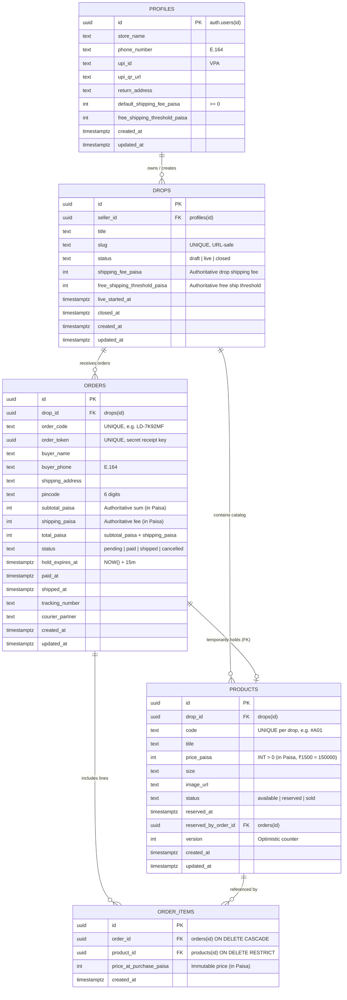

# 12 — Database Design & Transaction Architecture: LiveDrop

**Document Version:** 1.0.0  
**Effective Date:** 2026-09-11  
**Status:** Authoritative Baseline  
**Governing Document:** [`docs/SOURCE-OF-TRUTH.md`](file:///c:/LiveDrop/docs/SOURCE-OF-TRUTH.md)  
**Parent Technical Design:** [`docs/04-technical-design.md`](file:///c:/LiveDrop/docs/04-technical-design.md)  
**Data Dictionary:** [`docs/11-data-dictionary.md`](file:///c:/LiveDrop/docs/11-data-dictionary.md)  

---

## 1. Conceptual & Logical ER Diagram


```mermaid
erDiagram
    PROFILES ||--o{ DROPS : "owns / creates"
    DROPS ||--o{ PRODUCTS : "contains catalog"
    DROPS ||--o{ ORDERS : "receives orders"
    ORDERS ||--o{ ORDER_ITEMS : "includes lines"
    PRODUCTS ||--o{ ORDER_ITEMS : "referenced by"
    ORDERS ||--o| PRODUCTS : "temporarily holds (FK)"

    PROFILES {
        uuid id PK "auth.users(id)"
        text store_name
        text phone_number "E.164"
        text upi_id "VPA"
        text upi_qr_url
        text return_address
        int default_shipping_fee_paisa ">= 0"
        int free_shipping_threshold_paisa
        timestamptz created_at
        timestamptz updated_at
    }

    DROPS {
        uuid id PK
        uuid seller_id FK "profiles(id)"
        text title
        text slug "UNIQUE, URL-safe"
        text status "draft | live | closed"
        int shipping_fee_paisa "Authoritative drop shipping fee"
        int free_shipping_threshold_paisa "Authoritative free ship threshold"
        timestamptz live_started_at
        timestamptz closed_at
        timestamptz created_at
        timestamptz updated_at
    }

    PRODUCTS {
        uuid id PK
        uuid drop_id FK "drops(id)"
        text code "UNIQUE per drop, e.g. #A01"
        text title
        int price_paisa "INT > 0 (in Paisa, ₹1500 = 150000)"
        text size
        text image_url
        text status "available | reserved | sold"
        timestamptz reserved_at
        uuid reserved_by_order_id FK "orders(id)"
        int version "Optimistic counter"
        timestamptz created_at
        timestamptz updated_at
    }

    ORDERS {
        uuid id PK
        uuid drop_id FK "drops(id)"
        text order_code "UNIQUE, e.g. LD-7K92MF"
        uuid order_token "UNIQUE, secret receipt key"
        text buyer_name
        text buyer_phone "E.164"
        text shipping_address
        text pincode "6 digits"
        int subtotal_paisa "Authoritative sum (in Paisa)"
        int shipping_paisa "Authoritative fee (in Paisa)"
        int total_paisa "subtotal_paisa + shipping_paisa"
        text status "pending | paid | shipped | cancelled"
        timestamptz hold_expires_at "NOW() + 15m"
        timestamptz paid_at
        timestamptz shipped_at
        text tracking_number
        text courier_partner
        timestamptz created_at
        timestamptz updated_at
    }

    ORDER_ITEMS {
        uuid id PK
        uuid order_id FK "orders(id) ON DELETE CASCADE"
        uuid product_id FK "products(id) ON DELETE RESTRICT"
        int price_at_purchase_paisa "Immutable price (in Paisa)"
        timestamptz created_at
    }
```

---

## 2. Complete Reconciled Physical Schema (DDL)

```sql
-- LiveDrop Production Schema v2.0.0 (Hardened)
-- Database: PostgreSQL 15+ (Supabase)
-- Currency Standard: Integer Paisa (INR * 100) per ADR-009 & AGENTS.md

BEGIN;

CREATE EXTENSION IF NOT EXISTS "uuid-ossp";

-- ============================================================================
-- 1. TABLE: profiles
-- ============================================================================
CREATE TABLE profiles (
    id UUID PRIMARY KEY REFERENCES auth.users(id) ON DELETE CASCADE,
    store_name TEXT NOT NULL CHECK (char_length(store_name) BETWEEN 2 AND 100),
    phone_number TEXT NOT NULL CHECK (phone_number ~ '^[6-9]\d{9}$' OR phone_number ~ '^91[6-9]\d{9}$'),
    upi_id TEXT NOT NULL CHECK (upi_id ~ '^[a-zA-Z0-9.\-_]{2,255}@[a-zA-Z]{2,64}$'), -- Note: PostgreSQL REG_MAX_REPEAT caps repetition at 255
    upi_qr_url TEXT,
    return_address TEXT NOT NULL CHECK (char_length(return_address) BETWEEN 10 AND 500),
    default_shipping_fee_paisa INT NOT NULL DEFAULT 8000 CHECK (default_shipping_fee_paisa >= 0),
    free_shipping_threshold_paisa INT DEFAULT 200000 CHECK (free_shipping_threshold_paisa >= 0),
    created_at TIMESTAMPTZ NOT NULL DEFAULT NOW(),
    updated_at TIMESTAMPTZ NOT NULL DEFAULT NOW()
);

-- ============================================================================
-- 2. TABLE: drops
-- ============================================================================
CREATE TABLE drops (
    id UUID PRIMARY KEY DEFAULT gen_random_uuid(),
    seller_id UUID NOT NULL REFERENCES profiles(id) ON DELETE RESTRICT,
    title TEXT NOT NULL CHECK (char_length(title) BETWEEN 3 AND 150),
    slug TEXT UNIQUE NOT NULL CHECK (slug ~ '^[a-z0-9]+(?:-[a-z0-9]+)*$' AND char_length(slug) BETWEEN 3 AND 60),
    status TEXT NOT NULL CHECK (status IN ('draft', 'live', 'closed')) DEFAULT 'draft',
    shipping_fee_paisa INT NOT NULL DEFAULT 8000 CHECK (shipping_fee_paisa >= 0),
    free_shipping_threshold_paisa INT DEFAULT 200000 CHECK (free_shipping_threshold_paisa >= 0),
    live_started_at TIMESTAMPTZ,
    closed_at TIMESTAMPTZ,
    created_at TIMESTAMPTZ NOT NULL DEFAULT NOW(),
    updated_at TIMESTAMPTZ NOT NULL DEFAULT NOW()
);

-- ============================================================================
-- 3. TABLE: products
-- ============================================================================
CREATE TABLE products (
    id UUID PRIMARY KEY DEFAULT gen_random_uuid(),
    drop_id UUID NOT NULL REFERENCES drops(id) ON DELETE RESTRICT,
    code TEXT NOT NULL CHECK (code ~ '^#[A-Z0-9]{1,6}$'),
    title TEXT CHECK (char_length(title) <= 100),
    price_paisa INT NOT NULL CHECK (price_paisa > 0),
    size TEXT CHECK (char_length(size) <= 30),
    image_url TEXT NOT NULL CHECK (char_length(image_url) BETWEEN 1 AND 2048),
    status TEXT NOT NULL CHECK (status IN ('available', 'reserved', 'sold')) DEFAULT 'available',
    reserved_at TIMESTAMPTZ,
    reserved_by_order_id UUID, -- Foreign key established below
    version INT NOT NULL DEFAULT 1 CHECK (version >= 1),
    created_at TIMESTAMPTZ NOT NULL DEFAULT NOW(),
    updated_at TIMESTAMPTZ NOT NULL DEFAULT NOW(),
    UNIQUE(drop_id, code)
);

-- ============================================================================
-- 4. TABLE: orders
-- ============================================================================
CREATE TABLE orders (
    id UUID PRIMARY KEY DEFAULT gen_random_uuid(),
    drop_id UUID NOT NULL REFERENCES drops(id) ON DELETE RESTRICT,
    order_code TEXT UNIQUE NOT NULL CHECK (order_code ~ '^LD-[A-Z0-9]{6}$'),
    order_token UUID UNIQUE NOT NULL DEFAULT gen_random_uuid(),
    buyer_name TEXT NOT NULL CHECK (char_length(trim(buyer_name)) BETWEEN 3 AND 100),
    buyer_phone TEXT NOT NULL CHECK (buyer_phone ~ '^[6-9]\d{9}$' OR buyer_phone ~ '^91[6-9]\d{9}$'),
    shipping_address TEXT NOT NULL CHECK (char_length(trim(shipping_address)) BETWEEN 10 AND 500),
    pincode TEXT NOT NULL CHECK (pincode ~ '^\d{6}$'),
    subtotal_paisa INT NOT NULL CHECK (subtotal_paisa > 0),
    shipping_paisa INT NOT NULL DEFAULT 0 CHECK (shipping_paisa >= 0),
    total_paisa INT NOT NULL CHECK (total_paisa = subtotal_paisa + shipping_paisa),
    status TEXT NOT NULL CHECK (status IN ('pending', 'paid', 'shipped', 'cancelled')) DEFAULT 'pending',
    hold_expires_at TIMESTAMPTZ NOT NULL DEFAULT (NOW() + INTERVAL '15 minutes'),
    paid_at TIMESTAMPTZ,
    shipped_at TIMESTAMPTZ,
    tracking_number TEXT,
    courier_partner TEXT,
    created_at TIMESTAMPTZ NOT NULL DEFAULT NOW(),
    updated_at TIMESTAMPTZ NOT NULL DEFAULT NOW()
);

-- Establish foreign key from products to orders for reservation tracking
ALTER TABLE products 
ADD CONSTRAINT fk_products_reserved_by_order 
FOREIGN KEY (reserved_by_order_id) REFERENCES orders(id) ON DELETE RESTRICT;

-- ============================================================================
-- 5. TABLE: order_items
-- ============================================================================
CREATE TABLE order_items (
    id UUID PRIMARY KEY DEFAULT gen_random_uuid(),
    order_id UUID NOT NULL REFERENCES orders(id) ON DELETE CASCADE,
    product_id UUID NOT NULL REFERENCES products(id) ON DELETE RESTRICT,
    price_at_purchase_paisa INT NOT NULL CHECK (price_at_purchase_paisa > 0),
    created_at TIMESTAMPTZ NOT NULL DEFAULT NOW(),
    UNIQUE(order_id, product_id)
);

-- ============================================================================
-- 6. INDEXES
-- ============================================================================
CREATE INDEX idx_products_drop_status ON products(drop_id, status);
CREATE INDEX idx_products_active_hold ON products(reserved_at) WHERE status = 'reserved';
CREATE INDEX idx_orders_drop_status ON orders(drop_id, status);
-- order_token UNIQUE constraint already creates an implicit B-tree index; no explicit index needed.
CREATE INDEX idx_orders_hold_expiry ON orders(hold_expires_at) WHERE status = 'pending';
CREATE INDEX idx_orders_buyer_phone ON orders(buyer_phone);
CREATE INDEX idx_order_items_order ON order_items(order_id);
CREATE INDEX idx_order_items_product ON order_items(product_id);
-- RULE-DRP-03: A seller may have at most ONE drop in 'live' status at any time.
CREATE UNIQUE INDEX idx_drops_one_live_per_seller ON drops(seller_id) WHERE status = 'live';

-- ============================================================================
-- 7. TRIGGERS
-- ============================================================================
CREATE OR REPLACE FUNCTION set_updated_at()
RETURNS TRIGGER AS $$
BEGIN
    NEW.updated_at = NOW();
    RETURN NEW;
END;
$$ LANGUAGE plpgsql;

CREATE TRIGGER trg_profiles_updated_at BEFORE UPDATE ON profiles FOR EACH ROW EXECUTE FUNCTION set_updated_at();
CREATE TRIGGER trg_drops_updated_at    BEFORE UPDATE ON drops    FOR EACH ROW EXECUTE FUNCTION set_updated_at();
CREATE TRIGGER trg_products_updated_at BEFORE UPDATE ON products FOR EACH ROW EXECUTE FUNCTION set_updated_at();
CREATE TRIGGER trg_orders_updated_at   BEFORE UPDATE ON orders   FOR EACH ROW EXECUTE FUNCTION set_updated_at();

-- Prevent deletion of finalized (paid/shipped) orders for GST/financial record retention
CREATE OR REPLACE FUNCTION prevent_finalized_order_deletion()
RETURNS TRIGGER AS $$
BEGIN
    IF OLD.status IN ('paid', 'shipped') THEN
        RAISE EXCEPTION 'Cannot delete finalized order % with status "%"', OLD.id, OLD.status;
    END IF;
    RETURN OLD;
END;
$$ LANGUAGE plpgsql;

CREATE TRIGGER trg_orders_no_delete_finalized
    BEFORE DELETE ON orders FOR EACH ROW EXECUTE FUNCTION prevent_finalized_order_deletion();

COMMIT;
```

---

## 3. Database Correctness & Concurrency Review

### 3.1 Deadlock Prevention Strategy
In concurrent checkout bursts, if Buyer 1 requests items `[Item_B, Item_A]` and Buyer 2 requests `[Item_A, Item_B]`, unordered locking creates a cyclic dependency deadlock in PostgreSQL.
* **Mathematical Invariant:** All RPC functions enforce deterministic sorting on product IDs before executing `FOR UPDATE`:
  ```sql
  SELECT COUNT(*) INTO v_locked_count
  FROM products
  WHERE id = ANY(p_product_ids)
    AND drop_id = p_drop_id
    AND status = 'available'
  ORDER BY id ASC
  FOR UPDATE;
  ```
  Because both transactions acquire locks in identical primary key order, deadlocks are mathematically impossible.

### 3.2 Duplicate Product ID Injection Defense
If a malicious buyer sends `p_product_ids = [UUID_1, UUID_1]`, naive array length checks (`array_length(p_product_ids, 1)`) would evaluate to 2, but `SELECT COUNT(*)` on unique rows would yield 1, causing a false failure.
* **Defense Mechanism:** Input arrays are de-duplicated immediately upon entry:
  ```sql
  SELECT array_agg(DISTINCT id ORDER BY id) INTO v_sanitized_ids FROM unnest(p_product_ids) AS id;
  ```

### 3.3 Partial Collision Visibility
Instead of returning a flat `FALSE`, the database RPC outputs an explicit JSON structure containing:
* `unavailable_product_ids`: Array of UUIDs that failed the availability check.
This enables the client UI to highlight the exact contested dress and allow the buyer to proceed with remaining garments.

---

### 3.4 Lock Order for Payment, Hold and Checkout Functions (migration 035)
Audit finding SA-INT-002 found a deadlock between `verify_manual_upi_payment` (attempt locked before order) and `release_expired_holds` (order before attempt). Since migration 035 every function that touches orders, payment attempts and products takes locks in one fixed order:

`orders` → `payment_attempts` → `products` (products always `ORDER BY id`).

* `verify_manual_upi_payment` and `reject_manual_upi_payment` read the attempt's `order_id` without a lock, lock the order, then lock and re-read the attempt, then lock the products.
* `close_drop` locks orders → attempts → products and re-checks for claims under the order lock. `force_release_hold` locks only the order row (`FOR UPDATE OF o`).
* `release_expired_holds` and `release_stale_hold` never wait: they use `FOR UPDATE SKIP LOCKED` on orders, attempts and products and leave a busy row for the next run.
* Every product `UPDATE` carries its expected-status predicate and checks the affected row count (no blind overwrite of another order's reservation, SA-PAY-002).
* Verified by SQL suite 14 (14.3, 14.4: no deadlock; 14.5: lazy expiry under 40 concurrent racers; 14.6: ledger invariant).

## 4. Lifecycle & Ownership Boundary Rules

1. **Profile Deletion Guard (`ON DELETE RESTRICT`):** Deleting a seller profile is blocked if any drops exist. Profile cleanup must be handled via a SECURITY DEFINER RPC that verifies no active or historical orders exist before proceeding, or implements soft-delete.
2. **Drop Deletion Guard (`ON DELETE RESTRICT`):** Deleting a drop is blocked if any products exist. A drop can only be deleted when empty (no products). This is enforced both at the FK level and by RPC validation.
3. **Order Integrity Protection (`ON DELETE RESTRICT`):** A product that was ordered and sold cannot be hard-deleted from `products` (`order_items.product_id REFERENCES products(id) ON DELETE RESTRICT`). This preserves legal accounting and fulfillment records.
4. **Finalized Order Protection:** A trigger prevents deletion of orders in `paid` or `shipped` status, ensuring GST-compliant retention of completed financial transactions. Since migration 035 (SA-PAY-018) the trigger function `prevent_finalized_order_deletion()` is `SECURITY DEFINER SET search_path = public, pg_temp` and also refuses deletion of any order that has an `order_payments` row or `refund_status <> 'none'`; the error message names the reason.
5. **Reservation Integrity (`ON DELETE RESTRICT`):** An order cannot be deleted while any product references it via `reserved_by_order_id`. Reservation cleanup must occur before order deletion.
6. **Automatic Timestamps:** Triggers update `updated_at = NOW()` across `profiles`, `drops`, `products`, and `orders` on every modification.
7. **Cross-Seller Isolation Invariant (RPC-enforced):** The schema does not carry a `seller_id` on `orders` directly; seller ownership is derived via `orders.drop_id → drops.seller_id`. All RPCs that create orders MUST enforce `products.drop_id = p_drop_id` in the locking query to prevent cross-seller product inclusion.


---

## 5. Payment Claim Safety, Refund Obligations & In-Database Reaper (migrations 034–036)

Source: seller-app audit at commit 94ccfc9 (`audit/seller-app/`), findings SA-SEC-001, SA-PAY-001..006, SA-PAY-018, SA-OPS-001, SA-INT-002. Decisions: ADR-010, ADR-011.

### 5.1 `orders` refund columns (migration 035, ADR-010)

```sql
refund_status        TEXT NOT NULL DEFAULT 'none' CHECK (refund_status IN ('none','required','refunded'))
refund_amount_paisa  INT  NOT NULL DEFAULT 0      CHECK (refund_amount_paisa >= 0)
refund_reason        TEXT NULL          -- e.g. 'LATE_PAYMENT_INVENTORY_UNAVAILABLE'
refund_required_at   TIMESTAMPTZ NULL
refund_reference     TEXT NULL          -- UPI/bank reference typed by the seller
refunded_at          TIMESTAMPTZ NULL
refund_recorded_by   UUID NULL REFERENCES auth.users(id)

CHECK ((refund_status = 'none' AND refund_amount_paisa = 0)
    OR (refund_status <> 'none' AND refund_amount_paisa > 0 AND refund_amount_paisa <= total_paid_paisa))
CHECK (refund_status <> 'refunded' OR (refund_reference IS NOT NULL AND refunded_at IS NOT NULL))
-- partial index
CREATE INDEX ... ON orders (drop_id) WHERE refund_status = 'required';
```

* All refund columns are on the protected list of `enforce_orders_payment_immutability()`: sellers cannot change them with a direct `UPDATE` (SQL 19.7). Only `verify_manual_upi_payment`, `record_refund` and the service role write them.
* Orders flagged as refund-owed by the free-text note of migration 023 are backfilled to `refund_status = 'required'`.
* Money stays integer paisa.

### 5.2 Ledger invariant

`orders.total_paid_paisa = SUM(order_payments.amount_paisa WHERE status = 'verified')`. `verify_manual_upi_payment` checks it before writing (`LEDGER_INCONSISTENT`) and asserts it afterwards (`RAISE`, so the transaction rolls back). SQL 19.21 and 14.6 check every order.

### 5.3 New and changed functions

| Function | Change | Security |
|---|---|---|
| `verify_manual_upi_payment(uuid, text)` | On-time and late claims go through `apply_upi_payment_transition`. Late advance with free pieces → `confirmed/advance_paid` with correct amounts. Pieces resold → ledger row recorded, order stays cancelled/expired, refund obligation set. Claimed attempts stay verifiable past their window. `INVENTORY_CONFLICT` when an on-time order no longer holds its pieces. | `SECURITY DEFINER`, pinned `search_path` |
| `apply_upi_payment_transition(...)` (new, internal) | Shared state transition for verify. | EXECUTE revoked from PUBLIC, anon, authenticated, service_role |
| `upi_verification_response(...)` (new, internal) | Builds the verify response with every contract key. | EXECUTE revoked from client roles |
| `record_refund(uuid, text, text)` (new) | Marks a `required` refund as `refunded`. | EXECUTE to authenticated, service_role only |
| `force_release_hold(uuid)` | Returns `PAYMENT_CLAIM_PENDING` and changes nothing while a claim exists; expires unclaimed attempts on release. | unchanged grants |
| `reject_manual_upi_payment(uuid, text, boolean)` | Keeps the hold (`hold_released = false`) while another claim on the order is in flight. | unchanged grants |
| `release_expired_holds()` | Never cancels/expires an order with an attempt in `buyer_claimed`, `awaiting_seller_verification` or `late_claim_pending_review`. SKIP LOCKED throughout. | unchanged |
| `release_stale_hold(uuid)` (new, internal) | Releases one pending, expired, unclaimed order without waiting for any lock; returns false and changes nothing if a lock is busy. | EXECUTE revoked from PUBLIC, anon, authenticated, service_role |
| `create_order_with_reservation(...)` | Lazy expiry (step 9.1): after locking the cart pieces, a piece held by an expired unclaimed pending order is released via `release_stale_hold`. Signature, grants and errors unchanged. | unchanged |
| `close_drop(uuid)` | Lock order orders → attempts → products; claims stay untouched. | unchanged |
| `prevent_finalized_order_deletion()` | See §4 item 4. | now `SECURITY DEFINER`, EXECUTE revoked from client roles |

Data repair in 035: claims left in `awaiting_seller_verification` on cancelled/expired orders are moved to `late_claim_pending_review` so they can still be verified.

### 5.4 View privileges (migration 034)

Every view in `public` has `REVOKE ALL FROM PUBLIC, anon, authenticated` followed by `GRANT SELECT` back only to the roles that had it, plus explicit `SELECT` on `public_seller_storefronts` and `public_products_catalog` for anon, authenticated and service_role. The views stay owner-rights views. Default privileges in `public`: anon gets no INSERT/UPDATE/DELETE/TRUNCATE/REFERENCES/TRIGGER on new tables, authenticated no TRUNCATE/REFERENCES/TRIGGER; the same three are revoked on every existing public table. RLS is unchanged. See `16-security-architecture.md` §3.1.

### 5.5 Scheduled reaper (migration 036, ADR-011)

If `pg_cron` is available, 036 runs `CREATE EXTENSION IF NOT EXISTS pg_cron WITH SCHEMA pg_catalog`, unschedules any job named `livedrop-release-expired-holds` and schedules:

```sql
SELECT cron.schedule('livedrop-release-expired-holds', '* * * * *', 'SELECT public.release_expired_holds();');
```

Otherwise it raises a NOTICE and does nothing (exception-guarded DO block). The GitHub Actions workflow `reaper-cron.yml` is kept as a backup trigger only.

---

## 6. Storage, Suspension and UTR Guards (migration 038)

Source: seller-app audit (`audit/seller-app/`), findings SA-SEC-003, SA-SEC-008, SA-ONB-002, SA-PAY-011. Regression suites: SQL 11.5b/11.5c, 12.7, 13.3c, 18.1–18.1c, 20.1–20.34.

### 6.1 `product-images` storage policies
| Policy | Command | Role | Rule |
|---|---|---|---|
| `product_images_seller_read` (replaces `product_images_public_read`) | SELECT | `authenticated` | own folder only (`(storage.foldername(name))[1] = auth.uid()::text`) |
| `product_images_seller_insert` | INSERT | `authenticated` | own folder **and** `public.is_seller_approved(auth.uid())` |
| `product_images_seller_update` | UPDATE | `authenticated` | own folder **and** approved (USING and WITH CHECK) |
| `product_images_seller_delete` | DELETE | `authenticated` | own folder (unchanged from 027) |

Public object URLs of the public bucket do not depend on any policy, so buyers still see product photos. Nobody can list the bucket except a seller listing their own folder (the app's `upsert: true` uploads need it).

### 6.2 Seller suspension
* `close_drop_safely(p_drop_id) RETURNS int` (internal, SECURITY DEFINER, EXECUTE revoked from all client roles and `service_role`): the safe-closure steps of `close_drop`. It releases unpaid, unclaimed holds and keeps claims, late claims and paid orders. Then it closes the drop and returns the number of released orders. `close_drop` keeps its authorization, idempotency and response contract and calls this helper.
* Trigger `trg_close_live_drops_on_suspension` (AFTER UPDATE OF `is_approved` ON `profiles`, when approval goes from true to not true) calls `close_drop_safely` for every live drop of the seller. It fires for `admin_approve_seller(id, false)` and for a direct SQL update. Re-approval reopens nothing. A one-time, idempotent data repair in 038 closes live drops of sellers who were already unapproved.
* `create_order_with_reservation` and `initiate_payment_attempt` return `SELLER_SUSPENDED` when the seller is not approved. `submit_buyer_payment_claim`, `verify_manual_upi_payment` and `record_refund` are not blocked: money already sent always gets a record.

### 6.3 Payment reference normalisation
* `normalize_payment_reference(text) RETURNS text` (IMMUTABLE): whitespace removed, upper case, NULL when empty.
* Unique index `uq_order_payments_reference_verified_norm` on `order_payments (normalize_payment_reference(reference_id)) WHERE status = 'verified'`. If an existing ledger already contains a normalised duplicate, 038 skips the index and logs a WARNING (hosted check H22 lists the groups); the RPC checks below still apply.
* `submit_buyer_payment_claim` stores the normalised UTR and refuses a UTR already verified on another order (`REFERENCE_USED_ON_ANOTHER_ORDER`). The same UTR claimed but not verified on two orders is still accepted; verification refuses the second.
* `verify_manual_upi_payment` normalises the seller-typed or stored UTR and compares normalised references.
