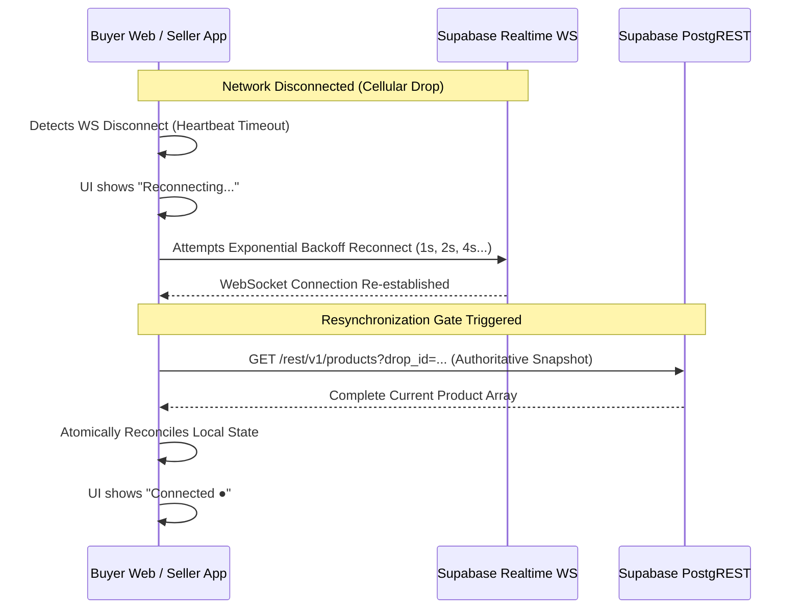

# 14 — Realtime Contract & WebSocket Specification: LiveDrop

**Document Version:** 1.0.0  
**Effective Date:** 2026-09-11  
**Status:** Authoritative Baseline  
**Governing Document:** [`docs/SOURCE-OF-TRUTH.md`](file:///c:/LiveDrop/docs/SOURCE-OF-TRUTH.md)  
**Parent Technical Design:** [`docs/04-technical-design.md`](file:///c:/LiveDrop/docs/04-technical-design.md)  

---

## 1. Realtime Architectural Principles

1. **Unreliable Transport Assumption:** WebSocket messages over Indian cellular networks (4G/5G) are subject to packet loss, connection drops, and out-of-order delivery. Realtime is treated strictly as an **ephemeral latency optimization**, not as the authoritative source of truth.
2. **Authoritative Reconciliation:** The PostgreSQL database is the sole arbiter of state. If a client disconnects or receives ambiguous events, it falls back to an authoritative REST fetch.
3. **Data Leak Prevention:** Realtime payloads broadcast to public buyers must **never** leak buyer identity, internal order IDs, or session tokens.

---

## 2. Channel & Event Topology

```
┌─────────────────────────────────────────────────────────────────────────────┐
│                           REALTIME TOPOLOGY                                 │
├──────────────────────────────────────┬──────────────────────────────────────┤
│ Channel A: Public Buyer Catalog      │ Channel B: Authenticated Seller Pipeline
├──────────────────────────────────────┼──────────────────────────────────────┤
│ • Name: `drop:{drop_id}:products`    │ • Name: `seller:{seller_id}:orders`  │
│ • Audience: Unauthenticated Buyers   │ • Audience: Authenticated Seller App │
│ • Security: Public Channel           │ • Security: Private RLS / JWT Filter │
│ • Events: `product_status_changed`   │ • Events: `order_created`, `updated` │
└──────────────────────────────────────┴──────────────────────────────────────┘
```

---

## 3. Channel Specifications

### 3.1 Channel: `drop:{drop_id}:products` (Buyer Feed)
Subscribed by all viewers browsing a specific live drop catalog.

* **PostgreSQL Source Table:** `products`
* **Filter:** `drop_id=eq.{drop_id}`
* **Listening Events:** `UPDATE`, `INSERT`
* **Subscription Code (Next.js Client):**
  ```typescript
  const channel = supabase
    .channel(`drop:${dropId}:products`)
    .on(
      'postgres_changes',
      {
        event: '*',
        schema: 'public',
        table: 'products',
        filter: `drop_id=eq.${dropId}`
      },
      (payload) => handleProductChange(payload)
    )
    .subscribe();
  ```

#### Payload: Product Status Change (`UPDATE`)
```json
{
  "schema": "public",
  "table": "products",
  "commit_timestamp": "2026-09-11T14:32:00.124Z",
  "eventType": "UPDATE",
  "new": {
    "id": "e9314c99-7f55-4089-a2bb-b001d2950df1",
    "drop_id": "c1f76d42-4f36-4d2b-9801-b5e1cf3e6801",
    "code": "#A01",
    "price": 1850.00,
    "status": "reserved",
    "reserved_at": "2026-09-11T14:32:00Z",
    "version": 2,
    "updated_at": "2026-09-11T14:32:00.124Z"
  },
  "old": {
    "id": "e9314c99-7f55-4089-a2bb-b001d2950df1",
    "status": "available",
    "version": 1
  }
}
```
*Note on Privacy:* Columns `reserved_by_order_id` are explicitly masked from public realtime payloads via Supabase column-level security or custom realtime publication.

---

### 3.2 Channel: `seller:{seller_id}:orders` (Seller Kanban)
Subscribed exclusively by the authenticated seller's Flutter application.

* **PostgreSQL Source Table:** `orders`
* **Filter:** Authenticated JWT matching drop's seller.
* **Listening Events:** `INSERT` (New incoming order), `UPDATE` (Order status transitions).
* **Subscription Code (Flutter Dart):**
  ```dart
  final channel = supabase
    .channel('seller-orders')
    .onPostgresChanges(
      event: PostgresChangeEvent.all,
      schema: 'public',
      table: 'orders',
      filter: PostgresChangeFilter(
        type: PostgresChangeFilterType.eq,
        column: 'drop_id',
        value: currentDropId,
      ),
      callback: (payload) => handleOrderEvent(payload),
    )
    .subscribe();
  ```

#### Payload: New Order Created (`INSERT`)
```json
{
  "schema": "public",
  "table": "orders",
  "commit_timestamp": "2026-09-11T14:32:01.050Z",
  "eventType": "INSERT",
  "new": {
    "id": "4b724590-7811-419b-a311-6b2a091df012",
    "drop_id": "c1f76d42-4f36-4d2b-9801-b5e1cf3e6801",
    "order_code": "LD-8F42",
    "buyer_name": "Sangeeta Mukherjee",
    "buyer_phone": "9830123456",
    "shipping_address": "Flat 4B, Greenview Apts, Jadavpur",
    "pincode": "700032",
    "subtotal_amount": 2600.00,
    "shipping_amount": 80.00,
    "total_amount": 2680.00,
    "status": "pending",
    "hold_expires_at": "2026-09-11T14:47:00Z",
    "created_at": "2026-09-11T14:32:01Z"
  }
}
```

---

## 4. Resilience & Reconciliation Protocol

### 4.1 Out-of-Order Event Defense
To prevent older events from overwriting newer local state, every entity contains a monotonic `version` integer:
```typescript
function handleProductChange(payload: RealtimePayload<Product>) {
  const incoming = payload.new;
  const current = localCatalogMap.get(incoming.id);

  // If local version is already equal or newer, discard stale event
  if (current && incoming.version <= current.version) {
    console.warn(`[Realtime] Discarded stale event for ${incoming.code}. Local v${current.version}, In v${incoming.version}`);
    return;
  }

  // Otherwise, commit new status to client UI state
  localCatalogMap.set(incoming.id, incoming);
  updateCardUI(incoming);
}
```

### 4.2 Reconnection & Resynchronization Flow
When network connectivity is interrupted (tunnel, cellular handover, screen sleep):



### 4.3 Concurrent Connection Throttling
Supabase Free Tier permits a maximum of **200 concurrent Realtime WebSocket connections**.
* **Throttling Policy:** 
  * If the client receives a `4429 (Too Many Connections)` or WebSocket failure, it drops to **long-polling fallback** (authoritative REST polling every 10 seconds).
  * Web clients automatically disconnect Realtime subscriptions when the browser tab transitions to `document.visibilityState === 'hidden'` for > 60 seconds, freeing connection slots for active viewers.
