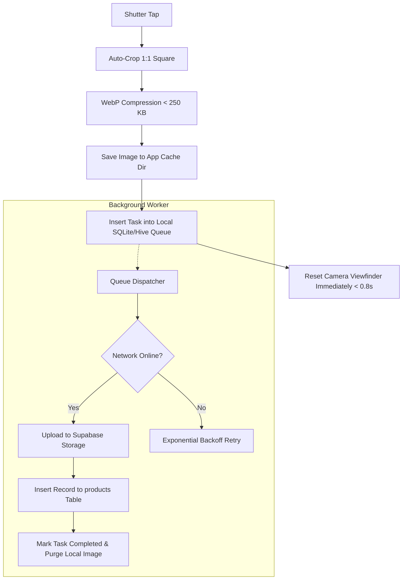

# 21 — Offline & Synchronization Strategy: LiveDrop

**Document Version:** 1.0.0  
**Effective Date:** 2026-09-11  
**Status:** Authoritative Baseline  
**Governing Document:** [`docs/SOURCE-OF-TRUTH.md`](file:///c:/LiveDrop/docs/SOURCE-OF-TRUTH.md)  
**Parent Technical Design:** [`docs/04-technical-design.md`](file:///c:/LiveDrop/docs/04-technical-design.md)  

---

## 1. Scope Boundary: Pragmatic MVP vs Future Vision

To avoid over-engineering distributed multi-master replication in MVP, LiveDrop strictly defines what is offline-capable:

```
┌─────────────────────────────────────────────────────────────────────────────┐
│                            OFFLINE CAPABILITY SCOPE                         │
├──────────────────────────────────────┬──────────────────────────────────────┤
│ Supported in MVP                     │ Explicitly Deferred to Future Phases │
├──────────────────────────────────────┼──────────────────────────────────────┤
│ • Seller Ingestion Upload Queue      │ • Offline order status transitions   │
│ • Local compressed image persistence │ • Offline Kanban drag-and-drop       │
│ • Automatic retry with backoff       │ • Multi-device offline reconciliation│
│ • Buyer webfront asset caching       │ • Offline buyer checkout (impossible │
│ • Optimistic cart additions/removals │   due to single-piece atomic locking)│
└──────────────────────────────────────┴──────────────────────────────────────┘
```

> [!IMPORTANT]
> **Why Buyer Checkout Can Never Be Offline:** Single-piece boutique inventory (`quantity = 1`) requires real-time, database-level atomic locking (`SELECT ... FOR UPDATE`). An offline buyer checkout would inevitably cause double-sold inventory collisions when syncing.

---

## 2. Seller App Background Ingestion Queue (MVP)

### 2.1 Workflow Architecture
During pre-live intake, a seller photographs 30–50 garments in rapid succession. If cellular signal fluctuates, the app must not freeze or block the camera shutter.



### 2.2 Local Queue Schema (SQLite / Hive)
```sql
CREATE TABLE local_upload_queue (
    task_id TEXT PRIMARY KEY,           -- UUIDv4
    drop_id TEXT NOT NULL,
    code TEXT NOT NULL,                 -- e.g. '#A15'
    title TEXT,
    price_paisa INTEGER NOT NULL CHECK (price_paisa > 0),
    size TEXT,
    local_image_path TEXT NOT NULL,     -- Absolute file path on device storage
    status TEXT NOT NULL,               -- 'pending', 'uploading', 'failed'
    retry_count INTEGER NOT NULL DEFAULT 0,
    created_at INTEGER NOT NULL,        -- Unix Epoch (ms)
    last_error TEXT
);
```

### 2.3 Retry Policy & Backoff Algorithm
* **Initial Attempt:** Immediate upon task creation.
* **Failure Retries:** Exponential backoff with jitter:
  $$t_{\text{wait}} = \min(30, 2^{\text{retry\_count}} + \text{random}(0, 1)) \text{ seconds}$$
* **Maximum Retries:** **10 attempts**. If 10 consecutive attempts fail, task status transitions to `failed` and prompts the seller with an explicit manual retry button.
* **Duplicate Upload Prevention:**
  * Image file name is derived deterministically from drop and code: `{drop_id}_{code}_{task_id}.webp`.
  * The Supabase Storage upload uses `upsert = false`. If a network glitch causes duplicate upload, the existing storage object is retained safely.

### 2.4 User-Visible Queue States
The camera intake screen displays a subtle, non-intrusive status pill:
* **All Synced:** `● All items uploaded` (Green).
* **Syncing in Progress:** `↻ Uploading 3 items...` (Blue with spinner).
* **Offline / Queued:** `☁ Offline — 5 items queued locally` (Amber).
* **Upload Error:** `⚠ 1 upload failed [Tap to Retry]` (Red).

---

## 3. Buyer Webfront Caching & Optimistic UI

### 3.1 Static Asset & Image Caching
* **Thumbnails:** Images served via CDN with header `Cache-Control: public, max-age=31536000, immutable`. Browsers cache thumbnails locally; revisiting a drop page costs zero network bandwidth.
* **Catalog Feed:** Next.js uses Stale-While-Revalidate (SWR) patterns:
  1. Render cached catalog feed immediately on page load.
  2. Background fetch pulls authoritative state from Supabase.
  3. Realtime WebSocket subscription pushes live deltas.

### 3.2 Optimistic Cart Operations
* Adding an item to bag updates client UI state immediately (`+ Add to Bag` ➔ `Added ✓`).
* Removing an item from cart drawer updates subtotal instantly.
* If checkout RPC fails due to stock collision, the optimistic state is automatically rolled back, highlighting the contested item for removal.

---

## 4. Post-MVP Offline Roadmap (Phase 3+)

1. **Offline Order Manifest:** Syncing paid order records to the mobile device so sellers can pack parcels in areas with zero cellular connectivity.
2. **Local PDF Generation:** The 4×6 inch thermal PDF is already generated client-side in Flutter; Phase 3 will allow printing cached orders completely offline.
3. **Conflict-Free Replicated Data Types (CRDTs):** Evaluation of CRDTs if multi-device seller editing is introduced in future boutique expansion.
