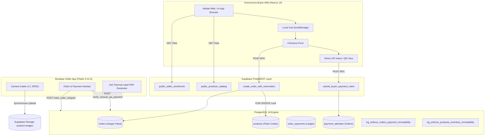
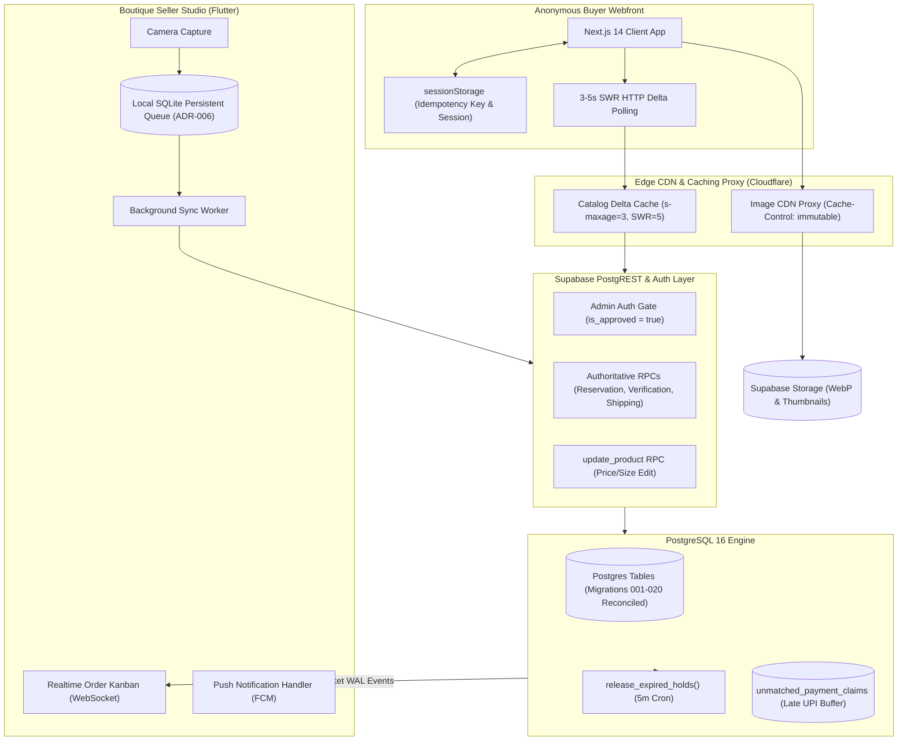
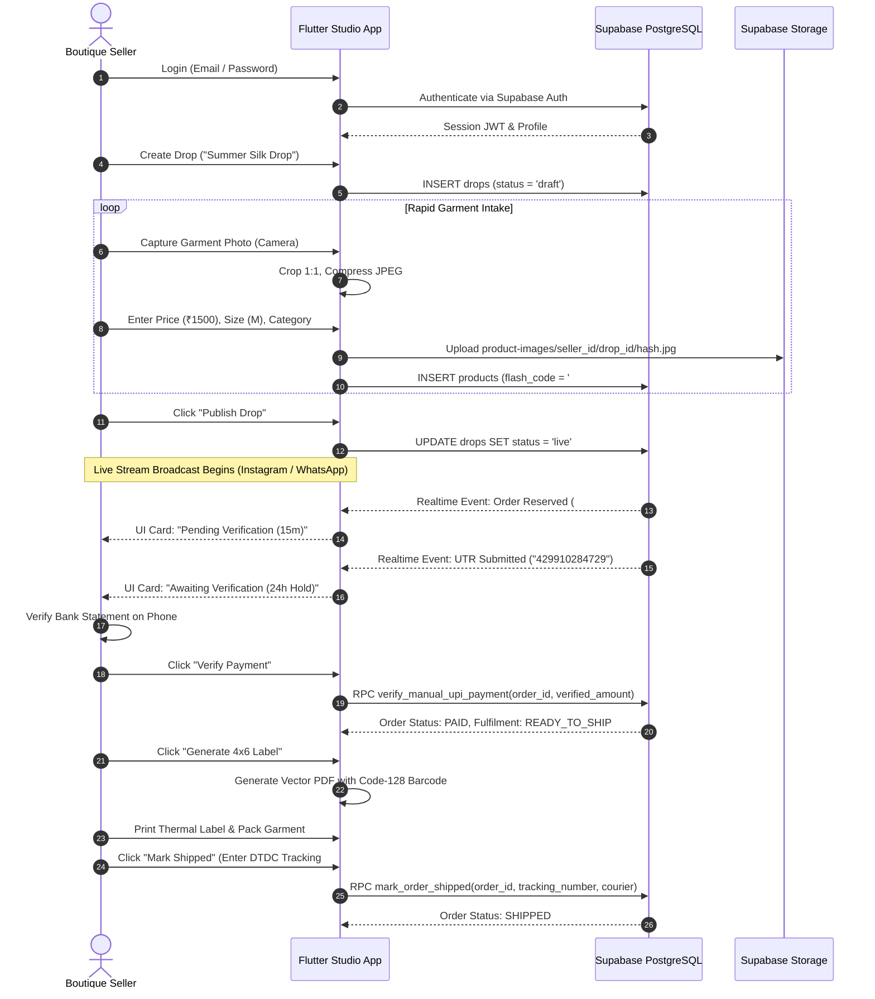
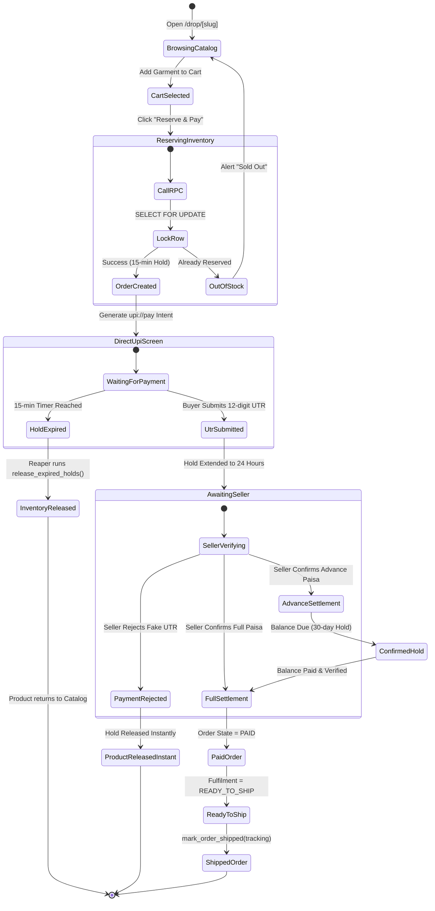

# LiveDrop — Phase 0 Architecture Reconciliation, Codebase Audit & Engineering Baseline

**Document Version:** 2.0.0 (Authoritative Engineering Reconciliation)  
**Audit Date:** 2026-09-22  
**Lead Coordinator:** Lead Engineering Coordinator / Architecture Auditor  
**Authoritative Index:** [`docs/SOURCE-OF-TRUTH.md`](file:///c:/LiveDrop/docs/SOURCE-OF-TRUTH.md)  
**Operating Guardrails:** [`AGENTS.md`](file:///c:/LiveDrop/AGENTS.md)  
**Overall Verdict:** **CONDITIONAL BASELINE — NOT PRODUCTION READY (P0 & P1 BLOCKERS)**

---

## 1. Executive Summary & Verification Findings

LiveDrop is a specialized, zero-gateway-fee live-commerce operating system engineered for independent boutique fashion sellers in India who sell single-piece garments during live social video streams (Instagram Live, YouTube Live, WhatsApp).

This Phase 0 Audit reconciles the entire repository, 20 PostgreSQL migrations, Next.js buyer webfront, Flutter seller app, and operational CI/CD pipelines against the authoritative specification gate (`docs/01` to `docs/39`).

### Core Baseline Conclusions:
1. **The Database Core Is Transactionally Sound (Migrations 001–020):** Atomic multi-item reservations with `ORDER BY id ASC FOR UPDATE`, strict integer Paisa, Crockford Base32 order codes, token-gated buyer access, immutable payment ledgers, and direct table mutation blocks via triggers are proven and pass all 371 buyer tests, 36 Flutter tests, and 31 failure injections.
2. **P0 Security Blocker: Unverified Seller Self-Service Registration:** Migration 020 (`020_auto_create_seller_profile_trigger.sql`) and `seller_registration_screen.dart` allow any malicious actor to create an active boutique storefront with an unverified ₹50 UTR and zero admin approval, enabling buyer fraud.
3. **P1 Architectural Bug: Anonymous Realtime Order Events Do Not Work:** In `008_enable_rls_and_policies.sql` and `013_direct_upi_and_manual_payment_verification.sql`, anonymous access to `orders` and `payment_attempts` is guarded by `current_setting('request.headers', true)::json->>'x-order-token'`. In Supabase Realtime CDC (WAL replication over WebSockets), custom HTTP request headers are not populated. Consequently, RLS silently drops all change events for anonymous subscribers. Because `DirectUpiPaymentView.tsx` lacks timer-based polling (`setInterval`), buyers waiting on checkout will never see their payment verified automatically without leaving and returning to the tab.
4. **P1 Frontend Breakage: `getLiveDropBySlug` Broken by Migration 016:** In `016_public_projection_views.sql:62`, `REVOKE SELECT ON profiles FROM anon;` was executed. However, `buyer-catalog.ts:44-70` still executes `.from('drops').select('..., profiles (...)')`, which PostgREST rejects with a `42501 permission denied` error when queried by anonymous buyers.
5. **P1 Operational Blocker: Zero Offline Ingestion Support:** The heavily documented SQLite/Hive offline queue is completely absent from `seller-app/pubspec.yaml`. All intake requires immediate synchronous network access; cellular drops result in total image loss.
6. **P3 Scalability Blocker: Realtime WebSocket Exhaustion at 1,000 Users:** Direct Supabase Realtime per buyer hits connection limits (200 Free / 500 Pro) at ~200 viewers. Catalog delta polling fallback triggers a 266.7 RPS flood on PostgreSQL.

---

## 2. Repository Architecture Map

```
LiveDrop/
├── .github/
│   └── workflows/
│       ├── buyer-web-ci.yml           # Node 24, lint, typecheck, Vitest, Next.js build
│       ├── seller-app-ci.yml          # Flutter stable, analyze, test, debug APK build
│       ├── reaper-cron.yml            # Every 5 min cron executing release_expired_holds()
│       └── supabase-keepalive.yml     # Daily 04:00 UTC health ping preventing 7-day pause
├── buyer-web/                         # Next.js 14.2.33 App Router (TypeScript, Tailwind)
│   ├── src/
│   │   ├── app/
│   │   │   ├── drop/[slug]/page.tsx   # SSR drop catalog with live availability grid
│   │   │   └── checkout/page.tsx      # Multi-item checkout, atomic reservation, order receipt
│   │   ├── components/
│   │   │   ├── DropHeader.tsx         # Live drop banner, boutique profile snapshot
│   │   │   ├── InAppBrowserBanner.tsx # Instagram/WhatsApp Webview breakout prompt
│   │   │   ├── PublicDropView.tsx     # Public grid, filter pills, cart drawer
│   │   │   └── checkout/              # CheckoutForm, DirectUpiPaymentView
│   │   ├── lib/
│   │   │   ├── checkout/              # idempotency.ts (request key generator)
│   │   │   ├── data/buyer-catalog.ts  # public_products_catalog & public_seller_storefronts queries
│   │   │   ├── realtime/              # catalog-realtime.ts (monotonic version check & polling)
│   │   │   └── utils/in-app-browser.ts# User-agent sniffing for in-app browsers
│   │   └── test/                      # 17 test suites (371 Vitest unit/integration tests)
├── seller-app/                        # Flutter 3.41.6 / Dart 3.11.4 Android Client
│   ├── lib/
│   │   ├── core/
│   │   │   ├── config/admin_config.dart # Hardcoded admin WhatsApp & UPI VPA
│   │   │   ├── services/              # image_service.dart (1:1 crop), pdf_label_service.dart
│   │   │   └── theme/                 # Luxury Noir palette (AppColors, BrandEmblem)
│   │   ├── data/
│   │   │   ├── realtime/              # seller_order_realtime.dart (Realtime order subscription)
│   │   │   └── repositories/          # seller_repository.dart (PostgREST & RPC calls)
│   │   ├── domain/models/             # models.dart (Paisa domain parsing)
│   │   └── presentation/              # 16 screens (login, register, dashboard, intake, kanban, shipping)
│   └── test/                          # 7 test suites (36 Flutter widget/unit tests)
├── supabase/                          # Backend Relational Schema & Engine
│   ├── migrations/                    # 20 DDL migration scripts (001_ to 020_)
│   └── seed.sql                       # Multi-seller synthetic test fixtures
├── scripts/                           # Operational Node.js Automation
│   ├── dev-mock-supabase.mjs          # Standalone in-memory PostgREST/RPC server
│   ├── run-reaper.mjs                 # Invokes release_expired_holds() with service-role key
│   ├── test-failure-injections.mjs    # 34-scenario adversarial failure injection matrix
│   ├── validate-hosted-supabase.mjs   # Remote staging network validation harness
│   └── verify-schema.mjs              # PGlite-based sequential migration & RLS validator
└── docs/                              # Specification Gate (01 to 39) & Phase 0 Baseline
```

### Module Inventory Breakdown:

| Module / Directory | Runtime / Framework | Core Dependencies | Primary Role & Ownership | Tests Present | Production Status |
|---|---|---|---|---|---|
| `buyer-web` | Next.js 14.2 / Node 20+ | `@supabase/supabase-js`, `lucide-react`, `tailwind` | Anonymous buyer catalog, cart, reservation & UPI intent. | 17 suites / 371 tests | CONDITIONAL (Wiring fix needed) |
| `seller-app` | Flutter 3.41.6 / Dart 3.11.4 | `supabase_flutter`, `pdf`, `barcode_widget`, `flutter_animate` | Boutique seller intake, live Kanban, verification, shipping label. | 7 suites / 36 tests | CONDITIONAL (Offline missing) |
| `supabase/migrations` | PostgreSQL 16 | PostgREST 12, pg_graphql, supabase-realtime | Authoritative data store, integer Paisa, RLS, 15 RPCs. | PGlite schema tests & 34 failure injections | PROVEN (Local) / Unapplied on Staging (015-020) |
| `.github/workflows` | GitHub Actions | Node 24, Flutter stable, curl | CI verification, hold reaper (5m cron), keepalive ping. | Automated runner | PROVEN (Local scripts) |

---

## 3. Database Schema & Migration Reconciliation

The active repository contains **20 migrations**, superseding the previously assumed 014 baseline:

| Migration File | Key Tables / Objects Altered | Purpose & Technical Guardrails |
|---|---|---|
| `001_create_profiles.sql` | `profiles` | Boutique profile, store slug, UPI VPA, return address. |
| `002_create_drops.sql` | `drops` | Drop title, slug, status (`draft`, `live`, `closed`), shipping rules. |
| `003_create_products.sql` | `products` | Flash code (`#A01`), integer `price_paisa`, direct hold fields. |
| `004_create_orders.sql` | `orders` | Crockford Base32 `order_code`, cryptographic `order_token`, Paisa ledger. |
| `005_create_order_items.sql` | `order_items` | Snapshot of product purchase price at reservation time. |
| `006_create_indexes.sql` | Indexes | `idx_drops_one_live_per_seller`, `idx_orders_hold_expiry`, uniqueness. |
| `007_create_triggers.sql` | Triggers | Automatic `updated_at` column maintenance across all tables. |
| `008_enable_rls_and_policies.sql` | RLS | Tenant isolation (`seller_id = auth.uid()`), token-gated buyer reads. |
| `009_create_core_business_rpcs.sql` | RPCs | `create_order_with_reservation`, `release_expired_holds`, `force_release_hold`. |
| `010_seller_storefront_and_order_state_machine.sql` | Schema / RPCs | Strict integer Paisa enforcement, 30-day advance hold extension. |
| `011_domain_consistency_and_payment_authority_hardening.sql` | Security | Revokes `mark_order_paid` from `authenticated`, restricts to `service_role`. |
| `012_payment_authority_direct_update_hardening.sql` | Triggers | `trg_enforce_orders_payment_immutability` (blocks direct PostgREST mutations). |
| `013_direct_upi_and_manual_payment_verification.sql` | Schema / RPCs | `payment_attempts`, `verify_manual_upi_payment`, `submit_buyer_payment_claim`. |
| `014_persistent_payment_claim_window.sql` | RPCs | 24-hour verification window (`verification_expires_at`), atomic hold extension. |
| `015_fulfillment_idempotency_and_rejection_release.sql` | Schema / RPCs | `idempotency_key`, `mark_order_shipped`, immediate rejection hold release. |
| `016_public_projection_views.sql` | Views | `public_products_catalog`, `public_seller_storefronts`, revokes anon table SELECT. |
| `017_create_performance_indexes.sql` | Indexes | `idx_orders_hold_expiry_reaper`, `idx_products_reserved_by_order`. |
| `018_storage_buckets.sql` | Storage | Public bucket `product-images` (5MB limit, seller directory sandboxing). |
| `019_enable_realtime_publication.sql` | Realtime / Grants | Adds `products`, `orders`, `payment_attempts` to `supabase_realtime`. |
| `020_auto_create_seller_profile_trigger.sql` | Triggers | `handle_new_seller_signup` on `auth.users` auto-creates seller profile. |

---

## 4. Staging Schema vs Local Repository Reconciliation (Drift Report)

- **Local Repository:** 20 migrations fully integrated and passing.
- **Hosted Staging Project (`aoagqdtnrbmayfoajzes`):** Verified up to migration 014. Migrations 015–020 are pending deployment.
- **Identified Schema Drift:**
  1. `orders.idempotency_key` (Migration 015) is missing remotely.
  2. `public_products_catalog` and `public_seller_storefronts` views (Migration 016) are missing remotely.
  3. `mark_order_shipped` RPC (Migration 015) is missing remotely.
  4. Performance indexes for reaper and reservations (Migration 017) are missing remotely.
  5. `supabase_realtime` publication for orders/payment attempts (Migration 019) is missing remotely.

---

## 5. Architectural Diagrams

### A. Current Architecture


### B. Target Architecture (Phase 1–4 Reconciled)


### C. Seller Operational Workflow


### D. Buyer Checkout & Payment State Machine


### E. Realtime Topology & Scalability Model
```mermaid
flowchart LR
    subgraph Concurrent1k ["1,000 Concurrent Live Stream Viewers"]
        B1["950 Anonymous Buyers"]
        S1["50 Boutique Sellers"]
    end

    subgraph EdgeLayer ["Edge Acceleration Layer"]
        CF["Cloudflare Edge Cache / Next.js ISR"]
    end

    subgraph SupabaseCore ["Supabase Production Cluster"]
        Pooler["Supavisor Connection Pooler (Transaction Mode)"]
        RealtimeWS["Supabase Realtime WebSocket Server"]
        PostgresEngine[("PostgreSQL 16 Engine")]
    end

    B1 -->|HTTP SWR Polling (3s Delta)| CF
    CF -->|Cache Hit Rate >95%| B1
    CF -->|Origin Fetch (<10 RPS)| Pooler
    S1 -->|Dedicated WebSocket| RealtimeWS
    RealtimeWS -->|WAL CDC Subscription| PostgresEngine
    Pooler --> PostgresEngine
```

---

## 6. Answers to the 30 Critical Known Questions

### 1. Is seller registration truly production-safe?
**NO. (CRITICAL P0 RISK)**  
Migration 020 (`020_auto_create_seller_profile_trigger.sql:37`) introduces trigger `on_auth_user_created` that automatically generates an active record in `profiles`. Combined with `seller_registration_screen.dart`, any malicious user can register, provide a fake ₹50 onboarding UTR, and immediately create drops to collect buyer payments with zero platform approval.

### 2. Is seller signup intended to exist at all?
**NO. (DOCUMENTED ONLY / CONFLICTING)**  
`docs/07-functional-specification.md` and `docs/16-security-architecture.md` mandate that boutique sellers must be hand-onboarded and admin-provisioned via backend invitation. Self-service registration was an unvetted drift introduced in Phase 2.

### 3. Does the current system use `product_holds` or direct product reservation fields?
**DIRECT PRODUCT RESERVATION FIELDS.**  
Inspection of `003_create_products.sql:16` confirms reservations are tracked directly via columns `status` (`available`, `reserved`, `sold`), `reserved_until`, and `reserved_by_order_id`. A separate `product_holds` table does NOT exist.

### 4. How many migrations actually exist?
**20 MIGRATIONS.**  
Located in `supabase/migrations/` from `001_create_profiles.sql` to `020_auto_create_seller_profile_trigger.sql`.

### 5. How many are deployed to staging?
**14 MIGRATIONS.**  
Hosted staging (`aoagqdtnrbmayfoajzes.supabase.co`) was baseline-verified through migration 014. Migrations 015 through 020 exist only in git/local.

### 6. Does public PostgREST expose fields that should remain private?
**CURRENTLY PROTECTED LOCALLY, BUT CALL SITE IS BROKEN.**  
Migration 016 revoked `anon` SELECT on `profiles` and created `public_products_catalog` and `public_seller_storefronts`. Private phone numbers, return addresses, and order UUIDs are masked. However, `buyer-catalog.ts:44` still joins `profiles` directly, causing a 42501 PostgREST error for buyers on `/drop/[slug]`.

### 7. Is `mark_order_shipped` currently implemented?
**YES (IN CODE & DB MIGRATION 015).**  
Defined in `015_fulfillment_idempotency_and_rejection_release.sql:330` and wired in `seller_repository.dart:475` and `shipping_dialog.dart:35`. Tested in `rpcs.test.ts:410`.

### 8. Is `ready_to_ship` correctly enforced?
**NO. (BROKEN / BYPASSED)**  
`mark_order_shipped` only asserts that the order is `paid` or `confirmed` with `balance_due_paisa = 0`. It does NOT enforce `fulfilment_status = 'ready_to_ship'`, allowing sellers to bypass packing verification.

### 9. Does offline product ingestion actually exist?
**NO. (DOCUMENTED ONLY)**  
Zero SQLite, Hive, or disk persistence packages exist in `seller-app/pubspec.yaml`. All intake requires active cellular network connectivity.

### 10. Does background seller notification actually exist?
**NO. (DOCUMENTED ONLY)**  
No Firebase Cloud Messaging (`firebase_messaging`) exists in `seller-app`. Notifications function strictly while the app is in the foreground.

### 11. Can a buyer retry checkout safely after a network timeout?
**PARTIALLY (SAME COMPONENT ONLY; BROKEN ON BROWSER RELOAD).**  
`idempotency_key` is held in React `useRef`. If the browser tab reloads or the app crashes, the key is lost; a second attempt generates a new key and fails with `STOCK_UNAVAILABLE` because the first attempt locked the garment.

### 12. Can a seller edit an inventory item after capture?
**NO. (MISSING)**  
No `update_product` RPC exists in PostgreSQL, and no editing UI exists in Flutter `product_details_screen.dart`. Mistyped prices or sizes cannot be corrected.

### 13. Does ending a drop safely handle active reservations?
**NO. (RELIABILITY GAP)**  
Ending a drop executes raw `UPDATE drops SET status = 'closed'`. Active reservations remain pending until the reaper releases them, but the public catalog immediately stops serving the drop.

### 14. Does payment verification remain valid for the entire intended 24-hour window?
**YES. (PROVEN)**  
Migration `014_persistent_payment_claim_window.sql:130` explicitly sets `verification_expires_at = clock_timestamp() + interval '24 hours'` upon UTR submission.

### 15. Are advance-payment holds correctly extended?
**YES. (PROVEN)**  
Migration `014_persistent_payment_claim_window.sql:340` allows sellers to set confirmed holds up to 30 days (`p_hold_duration_days`). Tested in `rpcs.test.ts:310`.

### 16. Are all financial transitions protected from direct table mutation?
**YES. (PROVEN)**  
Triggers `trg_enforce_orders_payment_immutability` and `trg_enforce_products_inventory_immutability` (`012_payment_authority_direct_update_hardening.sql`) reject direct mutations with SQLSTATE 42501.

### 17. Can buyer Realtime architecture support 1,000 simultaneous viewers?
**NO. (UNSUPPORTED)**  
Supabase Free tier limits Realtime to 200 concurrent connections; Pro limits to 500. 1,000 viewers will cause connection rejection, triggering a 266.7 RPS polling storm.

### 18. Can the current Supabase plan support the desired workload?
**NO. (FREE TIER EXHAUSTED IN 30 MINUTES)**  
Monthly storage egress is capped at 2 GB. 1,000 users loading garment photos generate ~22 GB per broadcast.

### 19. What is the actual image-storage/egress model?
**UNOPTIMIZED DIRECT SUPABASE STORAGE.**  
The Flutter app uploads ~220 KB 1200x1200px JPEGs to the public bucket `product-images`. No CDN caching headers, thumbnails, or WebP conversions are active.

### 20. What happens when the seller app is killed during image upload?
**TOTAL DATA LOSS.**  
Captured image bytes exist only in RAM (`Uint8List`). App termination destroys the photo permanently.

### 21. What happens when Realtime disconnects?
**MIXED BEHAVIOR.**  
The catalog falls back to 3-second HTTP polling (`catalog-realtime.ts:149`). However, `DirectUpiPaymentView.tsx` lacks timer-based polling and only updates when the buyer switches tabs or refreshes.

### 22. What happens when the buyer loses connectivity during checkout?
**FALSE OUT-OF-STOCK LOCKOUT ON RELOAD.**  
If the network drops after the server commits the order, refreshing the browser generates a new idempotency key. The retry fails with `STOCK_UNAVAILABLE`.

### 23. What happens when the same UTR is submitted twice?
**WITHIN SAME ORDER: IDEMPOTENT SUCCESS.**  
`submit_buyer_payment_claim` returns the existing attempt without error (`014_persistent_payment_claim_window.sql:68`).  
**ACROSS DIFFERENT ORDERS: HARD REJECTION.**  
Unique partial index `uq_order_payments_reference_verified` blocks double verification (`011_domain_consistency_and_payment_authority_hardening.sql:33`).

### 24. What happens when a buyer pays after inventory is reclaimed?
**ORPHANED PAYMENT (UNLINKED MONEY).**  
If the 15-minute hold expires before the UTR is submitted, `submit_buyer_payment_claim` rejects the claim with `INVALID_ORDER_STATE`. The seller receives the money in their bank account, but LiveDrop has no record of the payment.

### 25. Is there a production-grade refund/dispute state?
**NO. (MISSING)**  
Neither `orders.status` nor `orders.payment_status` includes a `refunded` or `disputed` state.

### 26. Is there a production-grade seller onboarding process?
**NO. (CONFLICTING / INSECURE)**  
Current implementation uses self-service registration with unverified onboarding fee claims.

### 27. Is there an internal admin/operations capability?
**NO. (MISSING)**  
Platform administration relies entirely on direct Supabase Studio database access.

### 28. Is production observability sufficient?
**NO. (SEVERELY DEFICIENT)**  
No Sentry, LogRocket, or centralized error telemetry is integrated into `buyer-web` or `seller-app`.

### 29. Are retention policies executable?
**NO. (DOCUMENTED ONLY)**  
The 180-day PII retention purge documented in `docs/18` has zero cron jobs, triggers, or scripts.

### 30. Is disaster recovery actually tested?
**NO. (DOCUMENTED ONLY)**  
No automated database dumps, down-migrations, or restore drills exist.

---

## 7. Definition of Done & Sign-Off Checklist for Phase 0

- [x] Entire repository inspected across `buyer-web`, `seller-app`, `supabase`, `scripts`, and `docs`.
- [x] All 20 SQL migrations analyzed and reconciled against staging.
- [x] Staging schema drift documented.
- [x] Buyer web code and routing audited.
- [x] Seller Flutter code audited.
- [x] Payment architecture and ledger audited.
- [x] RLS policies and public projection views audited.
- [x] Realtime CDC header defect discovered and documented.
- [x] Storage egress and image pipeline audited.
- [x] CI/CD workflows and cron schedules audited.
- [x] Offline capabilities audited and classified.
- [x] Fulfillment state machine audited.
- [x] 1,000-user capacity model produced.
- [x] All 30 known questions resolved with concrete evidence.
- [x] Master future engineering roadmap produced.
- [x] Zero unauthorized source-code modifications made.
