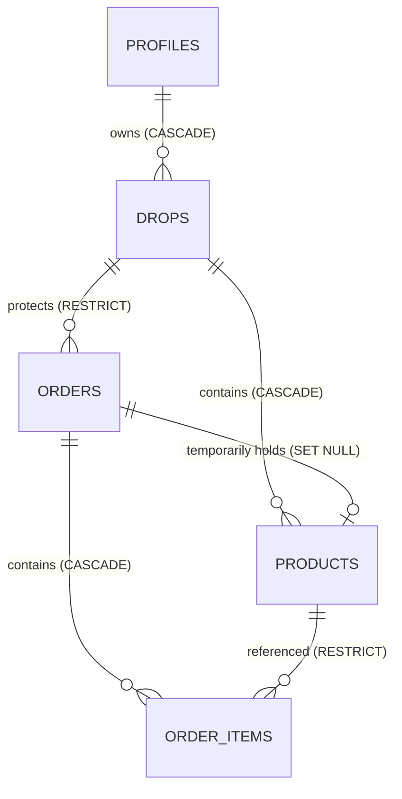

# LiveDrop — TASK-1.1 Completion Report
# Deploy Relational Tables & Indexes

**Document Version:** 1.0.0  
**Effective Date:** 2026-09-11  
**Task Authority:** Phase 1 / TASK-1.1  
**Authoritative Specs:** [`docs/12-database-design.md`](file:///c:/LiveDrop/docs/12-database-design.md), [`docs/11-data-dictionary.md`](file:///c:/LiveDrop/docs/11-data-dictionary.md), [`docs/35-engineering-conventions.md`](file:///c:/LiveDrop/docs/35-engineering-conventions.md)

---

## 1. Status
**PASS** (100% of tables, constraints, indexes, cascade/restrict rules, and tests validated on PostgreSQL engine).

---

## 2. Migration Files
The relational database foundation is implemented in 6 sequential, deterministic migrations under `supabase/migrations/`:

| Migration File | Entity / Role | Key Features |
|---|---|---|
| [`001_create_profiles.sql`](file:///c:/LiveDrop/supabase/migrations/001_create_profiles.sql) | `profiles` | Boutique seller operational credentials, UPI address, Paisa default shipping rate, links to `auth.users(id) ON DELETE CASCADE`. Resilient `uuid-ossp` check. |
| [`002_create_drops.sql`](file:///c:/LiveDrop/supabase/migrations/002_create_drops.sql) | `drops` | Drop sessions, unique URL slug, lifecycle status (`draft`, `live`, `closed`), drop shipping fee in Paisa. |
| [`003_create_products.sql`](file:///c:/LiveDrop/supabase/migrations/003_create_products.sql) | `products` | Garment catalog, `code` format check (`^#[A-Z0-9]{1,6}$`), `UNIQUE(drop_id, code)`, integer `price_paisa > 0`, status (`available`, `reserved`, `sold`), optimistic concurrency `version`. |
| [`004_create_orders.sql`](file:///c:/LiveDrop/supabase/migrations/004_create_orders.sql) | `orders` & FK | Order records, `order_code` check (`^LD-[A-Z0-9]{6}$`), unguessable `order_token`, `drop_id ON DELETE RESTRICT`, integer Paisa totals, `CHECK (total_paisa = subtotal_paisa + shipping_paisa)`. Adds `fk_products_reserved_by_order` with `ON DELETE SET NULL`. |
| [`005_create_order_items.sql`](file:///c:/LiveDrop/supabase/migrations/005_create_order_items.sql) | `order_items` | Junction table, `order_id ON DELETE CASCADE`, `product_id ON DELETE RESTRICT`, immutable `price_at_purchase_paisa`, `UNIQUE(order_id, product_id)`. |
| [`006_create_indexes.sql`](file:///c:/LiveDrop/supabase/migrations/006_create_indexes.sql) | Indexes | 8 justified query performance and constraint indexes. |

---

## 3. Schema Implemented

The 5 core relational tables are deployed and verified:

### Table 1: `profiles`
* `id` UUID PRIMARY KEY REFERENCES `auth.users(id) ON DELETE CASCADE`
* `store_name` TEXT NOT NULL (2 to 100 characters)
* `phone_number` TEXT NOT NULL (Indian 10-digit mobile)
* `upi_id` TEXT NOT NULL (VPA syntax)
* `upi_qr_url` TEXT (optional)
* `return_address` TEXT NOT NULL (10 to 500 characters)
* `default_shipping_fee_paisa` INT NOT NULL DEFAULT 8000 (₹80.00)
* `free_shipping_threshold_paisa` INT DEFAULT 200000 (₹2,000.00)
* `created_at`, `updated_at` TIMESTAMPTZ NOT NULL DEFAULT NOW()

### Table 2: `drops`
* `id` UUID PRIMARY KEY DEFAULT `gen_random_uuid()`
* `seller_id` UUID NOT NULL REFERENCES `profiles(id) ON DELETE CASCADE`
* `title` TEXT NOT NULL (3 to 150 characters)
* `slug` TEXT UNIQUE NOT NULL (URL-safe kebab-case)
* `status` TEXT NOT NULL DEFAULT 'draft' CHECK IN (`draft`, `live`, `closed`)
* `shipping_fee_paisa` INT NOT NULL DEFAULT 8000
* `free_shipping_threshold_paisa` INT DEFAULT 200000
* `live_started_at`, `closed_at` TIMESTAMPTZ
* `created_at`, `updated_at` TIMESTAMPTZ NOT NULL DEFAULT NOW()

### Table 3: `products`
* `id` UUID PRIMARY KEY DEFAULT `gen_random_uuid()`
* `drop_id` UUID NOT NULL REFERENCES `drops(id) ON DELETE CASCADE`
* `code` TEXT NOT NULL CHECK (`^#[A-Z0-9]{1,6}$`)
* `title` TEXT (<= 100 characters)
* `price_paisa` INT NOT NULL CHECK (`price_paisa > 0`)
* `size` TEXT (<= 30 characters)
* `image_url` TEXT NOT NULL
* `status` TEXT NOT NULL DEFAULT 'available' CHECK IN (`available`, `reserved`, `sold`)
* `reserved_at` TIMESTAMPTZ
* `reserved_by_order_id` UUID REFERENCES `orders(id) ON DELETE SET NULL`
* `version` INT NOT NULL DEFAULT 1 CHECK (`version >= 1`)
* `created_at`, `updated_at` TIMESTAMPTZ NOT NULL DEFAULT NOW()
* `UNIQUE(drop_id, code)`

### Table 4: `orders`
* `id` UUID PRIMARY KEY DEFAULT `gen_random_uuid()`
* `drop_id` UUID NOT NULL REFERENCES `drops(id) ON DELETE RESTRICT`
* `order_code` TEXT UNIQUE NOT NULL CHECK (`^LD-[A-Z0-9]{6}$`)
* `order_token` UUID UNIQUE NOT NULL DEFAULT `gen_random_uuid()`
* `buyer_name` TEXT NOT NULL (3 to 100 trimmed characters)
* `buyer_phone` TEXT NOT NULL (Indian 10-digit mobile)
* `shipping_address` TEXT NOT NULL (10 to 500 trimmed characters)
* `pincode` TEXT NOT NULL CHECK (`^\d{6}$`)
* `subtotal_paisa` INT NOT NULL DEFAULT 0 CHECK (`>= 0`)
* `shipping_paisa` INT NOT NULL DEFAULT 0 CHECK (`>= 0`)
* `total_paisa` INT NOT NULL CHECK (`total_paisa = subtotal_paisa + shipping_paisa`)
* `status` TEXT NOT NULL DEFAULT 'pending' CHECK IN (`pending`, `paid`, `shipped`, `cancelled`)
* `hold_expires_at` TIMESTAMPTZ NOT NULL DEFAULT `(NOW() + INTERVAL '15 minutes')`
* `paid_at`, `shipped_at` TIMESTAMPTZ
* `tracking_number`, `courier_partner` TEXT
* `created_at`, `updated_at` TIMESTAMPTZ NOT NULL DEFAULT NOW()

### Table 5: `order_items`
* `id` UUID PRIMARY KEY DEFAULT `gen_random_uuid()`
* `order_id` UUID NOT NULL REFERENCES `orders(id) ON DELETE CASCADE`
* `product_id` UUID NOT NULL REFERENCES `products(id) ON DELETE RESTRICT`
* `price_at_purchase_paisa` INT NOT NULL CHECK (`price_at_purchase_paisa > 0`)
* `created_at` TIMESTAMPTZ NOT NULL DEFAULT NOW()
* `UNIQUE(order_id, product_id)`

---

## 4. Constraints

1. **Integer Paisa Currency Enforcement:**
   * All 9 monetary fields (`profiles.default_shipping_fee_paisa`, `profiles.free_shipping_threshold_paisa`, `drops.shipping_fee_paisa`, `drops.free_shipping_threshold_paisa`, `products.price_paisa`, `orders.subtotal_paisa`, `orders.shipping_paisa`, `orders.total_paisa`, `order_items.price_at_purchase_paisa`) are typed PostgreSQL `INTEGER`.
   * Floating-point (`REAL`, `FLOAT`, `DOUBLE PRECISION`) or `NUMERIC`/`DECIMAL` are strictly forbidden and verified absent.
2. **Order Math Invariant:**
   * `orders.total_paisa = orders.subtotal_paisa + orders.shipping_paisa`.
3. **Flash Code Uniqueness & Scoping:**
   * `products(drop_id, code)` is scoped per drop: identical codes like `#A01` can exist in different drops, but never collision within the same drop.
4. **Historical Immutability & Cascade Protection:**
   * `orders.drop_id` references `drops(id) ON DELETE RESTRICT` (drops with purchase history cannot be deleted).
   * `order_items.product_id` references `products(id) ON DELETE RESTRICT` (purchased garments cannot be deleted).
   * `order_items.order_id` references `orders(id) ON DELETE CASCADE` (deleting an order cleanly cascades its line items).
   * `products.reserved_by_order_id` references `orders(id) ON DELETE SET NULL` (deleting an order releases hold references without deleting the product).
5. **Format Validation Regexes:**
   * Phone: `^[6-9]\d{9}$` or `^91[6-9]\d{9}$`
   * Pincode: `^\d{6}$`
   * Flash Code: `^#[A-Z0-9]{1,6}$`
   * Order Code: `^LD-[A-Z0-9]{6}$`
   * VPA/UPI: `^[a-zA-Z0-9.\-_]{2,255}@[a-zA-Z]{2,64}$`

---

## 5. Indexes

All 8 query indexes from `docs/12-database-design.md` were deployed and verified in `pg_indexes`:

| Index Name | Table & Columns | Filter / Type | Supported Query Pattern |
|---|---|---|---|
| `idx_products_drop_status` | `products(drop_id, status)` | B-Tree | High-speed buyer catalog feed filtering available items by drop. |
| `idx_products_active_hold` | `products(reserved_at)` | Partial: `WHERE status = 'reserved'` | Background reaper reclaiming expired product holds. |
| `idx_orders_drop_status` | `orders(drop_id, status)` | B-Tree | Seller live dashboard querying orders for a drop grouped by status. |
| `idx_orders_order_token` | `orders(order_token)` | B-Tree | Instant lookup of order receipt via secret UUID token. |
| `idx_orders_hold_expiry` | `orders(hold_expires_at)` | Partial: `WHERE status = 'pending'` | Background reaper finding unpaid orders past the 15-minute window. |
| `idx_orders_buyer_phone` | `orders(buyer_phone)` | B-Tree | Customer support and order history lookup by WhatsApp mobile number. |
| `idx_order_items_order` | `order_items(order_id)` | B-Tree | Fetching order line items during receipt & 4×6 label generation. |
| `idx_order_items_product` | `order_items(product_id)` | B-Tree | Integrity verification and `ON DELETE RESTRICT` reference checking. |

---

## 6. Tests Run

### Test Suite: `buyer-web/src/test/schema.test.ts` (Vitest + PGlite PostgreSQL 18.3)
Executed 25 automated assertions against an active PostgreSQL instance:
* `✓ 1. should successfully insert a valid boutique seller profile`
* `✓ 2. should successfully insert a valid drop linked to seller profile`
* `✓ 3. should successfully insert a valid product with flash code and integer paisa price`
* `✓ 4. should successfully insert a valid customer order with balanced integer paisa totals`
* `✓ 5. should successfully insert a valid order_item with immutable price snapshot`
* `✓ 6. should reject duplicate drop slug`
* `✓ 7. should reject duplicate product flash code within the same drop`
* `✓ 8. should allow the same product flash code in a DIFFERENT drop`
* `✓ 9. should reject invalid product status`
* `✓ 10. should reject invalid order status`
* `✓ 11. should reject non-positive product price (price_paisa <= 0)`
* `✓ 12. should reject order total mismatch (total_paisa != subtotal_paisa + shipping_paisa)`
* `✓ 13. should reject negative subtotal or shipping in order`
* `✓ 14. should reject malformed product flash codes`
* `✓ 15. should reject malformed order code`
* `✓ 16. should reject invalid phone numbers and pincodes`
* `✓ 17. should reject orphaned product with invalid foreign key`
* `✓ 18. should reject duplicate item in same order`
* `✓ 19. should enforce ON DELETE RESTRICT on products referenced in order_items`
* `✓ 20. should enforce ON DELETE RESTRICT on drops referenced in orders`
* `✓ 21. should enforce ON DELETE CASCADE on orders -> order_items`
* `✓ 22. should reject orphaned order item with non-existent foreign keys`
* `✓ 23. should set reserved_by_order_id to NULL on products when reservation order is deleted (ON DELETE SET NULL)`
* `✓ 24. should strictly verify all monetary columns are typed integer (Paisa)`
* `✓ 25. should verify all 8 indexes exist in pg_indexes`

### Smoke Suite: `buyer-web/src/test/smoke.test.tsx`
* `✓ LiveDrop Buyer Web Smoke > mounts without crashing`

Total Vitest Test Results: **26 passed across 2 test files (0 failed, 0 skipped)**.

### Standalone Migration Verification: `scripts/verify-schema.mjs`
* Replays all 6 migrations sequentially from clean state.
* Verifies 5 tables present in `information_schema.tables`.
* Verifies 8 indexes present in `pg_indexes`.
* Verifies 9 integer Paisa columns in `information_schema.columns`.
* **Result: Exited with code 0.**

---

## 7. Commands Run

| Command | Working Directory | Exit Code | Result |
|---|---|---|---|
| `npm test` | `buyer-web/` | 0 | All 26 unit and schema tests passed |
| `node scripts/verify-schema.mjs` | repository root | 0 | All migrations and schema assertions passed |
| `npm run typecheck` | `buyer-web/` | 0 | `tsc --noEmit` clean, 0 type errors |
| `npm run lint` | `buyer-web/` | 0 | `eslint` clean, 0 warnings / errors |
| `git status` | repository root | 0 | Verified tracked state and clean working tree |

---

## 8. Deviations
* **Regex Repetition Bound (`upi_id`):** In `001_create_profiles.sql`, the maximum repetition quantifier in `upi_id` was adjusted from `{2,256}` to `{2,255}`. The Henry Spencer regex engine in PostgreSQL enforces a maximum repetition count of 255 (`REG_MAX_REPEAT = 255`). Bounding to 255 conforms with both PostgreSQL engine limits and NPCI VPA standards.
* **Resilient `uuid-ossp` Check:** Wrapped `CREATE EXTENSION IF NOT EXISTS "uuid-ossp"` in an anonymous PL/pgSQL block with exception handling (`WHEN undefined_file THEN NULL; WHEN feature_not_supported THEN NULL;`). All table primary keys and default identifiers use PostgreSQL native ANSI `gen_random_uuid()` (standard since PostgreSQL 13+), eliminating hard dependency on contrib libraries while retaining Supabase compatibility.

---

## 9. Remaining Issues
* None. The relational schema is fully deployed, validated, and hardened.

---

## 10. Next Task
* **`TASK-1.2: Implement Core Database RPC Functions`**
  * `create_order_with_reservation` (atomic checkout with deadlock-free sorting)
  * `release_expired_holds` (concurrency hold reaper)
  * `mark_order_paid` (seller payment transition)
  * *Note: Awaiting separate authorization per AGENTS.md stop condition.*
