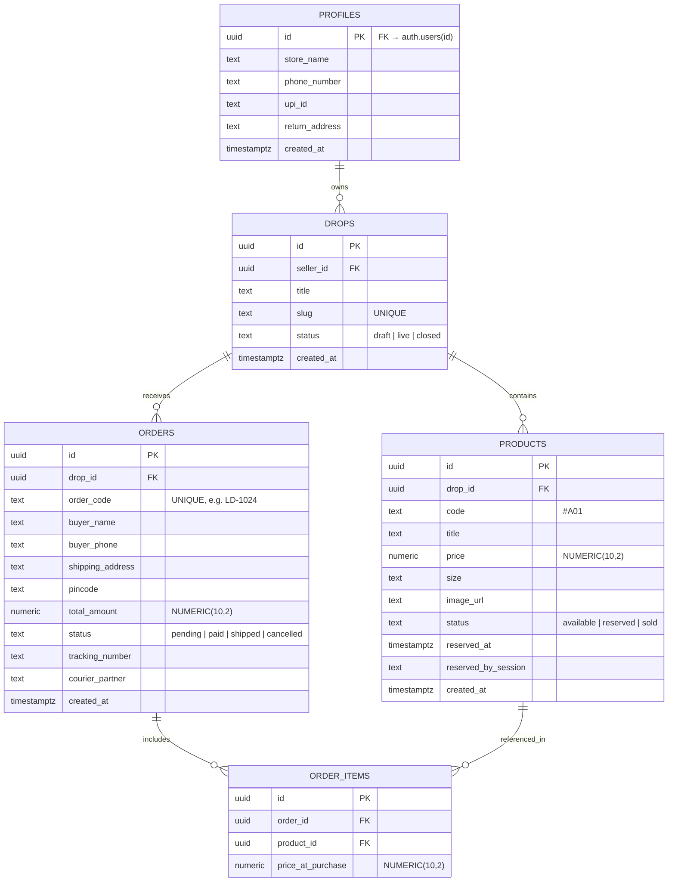

# Technical Design Document: LiveDrop

**Document Version:** 1.0.0
**Date:** 2026-09-11
**Author:** Architect Review (Claude Opus 4.6)
**Status:** Draft — Pending Team Approval

---

## Table of Contents

1. [Project Overview](#1-project-overview)
2. [System Architecture](#2-system-architecture)
3. [Technology Stack](#3-technology-stack)
4. [Data Model & Database Schema](#4-data-model--database-schema)
5. [API & Data Flow Design](#5-api--data-flow-design)
6. [Buyer Webfront — Technical Specification](#6-buyer-webfront--technical-specification)
7. [Seller Mobile App — Technical Specification](#7-seller-mobile-app--technical-specification)
8. [Concurrency & Stock Reservation Engine](#8-concurrency--stock-reservation-engine)
9. [Security Architecture](#9-security-architecture)
10. [Infrastructure & Deployment](#10-infrastructure--deployment)
11. [Component Directory & File Structure](#11-component-directory--file-structure)
12. [Edge Cases & Failure Modes](#12-edge-cases--failure-modes)
13. [Performance Budget & Constraints](#13-performance-budget--constraints)
14. [Development Workflow & Agentic Strategy](#14-development-workflow--agentic-strategy)
15. [Implementation Roadmap](#15-implementation-roadmap)
16. [Open Questions & Risks](#16-open-questions--risks)

---

## 1. Project Overview

### 1.1 What is LiveDrop?

LiveDrop is a **two-tier live-commerce and order dispatch platform** purpose-built for independent home boutique sellers who operate via Facebook Live and WhatsApp. It pairs a **native Flutter mobile app for sellers** with a **zero-download Next.js web catalog for buyers**, connected through a shared Supabase backend.

### 1.2 Problem Statement

Home boutique sellers on Facebook Live face four systemic bottlenecks:

| # | Bottleneck | Impact |
|---|---|---|
| 1 | **Item Identification Breakdown** | Buyers send vague descriptions or blurry screenshots; wrong items get packaged |
| 2 | **Single-Piece Concurrency Collisions** | Multiple buyers claim the same one-of-a-kind garment; seller reputation damage |
| 3 | **Cart Bundling Friction** | Buyers wanting items from different points in a 90-min stream require multiple disconnected WhatsApp threads |
| 4 | **Fulfillment Inefficiency** | 3–5 hours post-broadcast spent transcribing addresses and handwriting courier slips |

### 1.3 Core Design Principles

- **Zero buyer friction** — No app downloads, no account registration, no passwords
- **Sub-30-second seller workflows** — Every intake action optimized for speed
- **₹0 operating cost** — Entire stack runs within cloud free tiers permanently
- **WhatsApp-native checkout** — Leverages the messaging channel buyers already trust
- **Atomic single-piece protection** — Database-level guarantees against double-booking

### 1.4 Target Users

| Persona | Platform | Key Constraint |
|---|---|---|
| **Home Boutique Seller** | Android smartphone | Non-technical; proficient only in WhatsApp, Facebook, and UPI |
| **Social Shopper** | Mobile browser (Facebook/WhatsApp in-app) | Will abandon instantly if forced to download an app or create an account |

---

## 2. System Architecture

### 2.1 High-Level Architecture

```
                          ┌───────────────────────────┐
                          │   Supabase Cloud           │
                          │   ┌─────────────────────┐ │
                          │   │ PostgreSQL Database  │ │
                          │   │ Realtime WebSockets  │ │
                          │   │ Auth (Email/Password)│ │
                          │   │ Storage (Images)     │ │
                          │   │ Edge Functions       │ │
                          │   └─────────────────────┘ │
                          └─────────────┬─────────────┘
                                        │
                ┌───────────────────────┴───────────────────────┐
                │                                               │
                ▼                                               ▼
┌───────────────────────────────┐               ┌───────────────────────────────┐
│     SELLER OPERATIONS APP     │               │      BUYER WEB CATALOG        │
│   (Flutter Native Android)    │               │   (Next.js / Edge SSR)        │
├───────────────────────────────┤               ├───────────────────────────────┤
│ • Camera → WebP → Upload      │               │ • SSR product grid            │
│ • Realtime order subscription │               │ • Client-side cart state      │
│ • Kanban pipeline UI          │  ◄──────────► │ • Supabase RPC for holds      │
│ • PDF label generation        │   (Realtime)  │ • WhatsApp deep-link builder  │
│ • Supabase Auth (seller only) │               │ • No authentication required  │
└───────────────────────────────┘               └───────────────────────────────┘
```

### 2.2 Data Flow Summary

```
[Pre-Live Ingestion] ──► [Live Broadcast] ──► [Buyer Cart & Hold] ──► [WhatsApp DM] ──► [1-Tap Fulfillment]
  Seller App                Seller pins         Buyer web catalog       Pre-filled         Seller App:
  snap → tag → publish      catalog link        atomic reserve          order text          verify → label → dispatch
```

### 2.3 Communication Patterns

| Channel | Direction | Protocol | Purpose |
|---|---|---|---|
| Buyer Web → Supabase | Client → Server | HTTPS (REST / RPC) | Order creation, stock reservation |
| Supabase → Buyer Web | Server → Client | WebSocket (Realtime) | Live stock status updates |
| Supabase → Seller App | Server → Client | WebSocket (Realtime) | New order push notifications |
| Seller App → Supabase | Client → Server | HTTPS (REST) | Order status updates, product CRUD |
| Buyer → Seller | Client → Client | WhatsApp deep link (`wa.me`) | Order handshake & payment coordination |

---

## 3. Technology Stack

### 3.1 Stack Selection Rationale

| Layer | Technology | Justification |
|---|---|---|
| **Buyer Webfront** | Next.js (App Router) | Server-side rendering for <1.5s load in Facebook in-app browser; OpenGraph previews |
| **Web Hosting** | Cloudflare Pages or Vercel | Edge deployment, unlimited static requests on free tier |
| **Seller App** | Flutter 3.x (Android) | Native camera access, offline-first storage, PDF generation, snappy animations |
| **App Distribution** | Direct APK sideload | Bypasses $25 Google Play fee; single-user seller scenario |
| **Backend** | Supabase (PostgreSQL + Auth + Realtime + Storage + Edge Functions) | Full relational DB, real-time WebSockets, file storage, and serverless functions in one free-tier platform |
| **Image Pipeline** | Supabase Storage or Cloudinary | Auto WebP compression, CDN delivery, <40 KB per thumbnail |
| **Payment** | Direct UPI (P2P / Static QR) | 0% transaction fees; no payment gateway integration required |

### 3.2 Key Dependencies

#### Buyer Webfront (Next.js)
```
next@latest            # App Router, SSR, API routes
@supabase/supabase-js  # Client SDK (REST + Realtime)
```

#### Seller App (Flutter)
```yaml
dependencies:
  supabase_flutter: ^2.x    # Supabase SDK
  camera: ^0.x               # Hardware camera access
  image_picker: ^1.x          # Gallery fallback
  pdf: ^3.x                   # PDF document generation
  printing: ^5.x              # Bluetooth/system print
  flutter_image_compress: ^2.x # Client-side WebP compression
  hive: ^2.x                  # Offline-first local cache
  barcode_widget: ^2.x        # 1D barcode for order IDs
```

---

## 4. Data Model & Database Schema

### 4.1 Entity Relationship Diagram



### 4.2 SQL Migration

```sql
-- 1. PROFILES / SELLERS
CREATE TABLE profiles (
    id UUID PRIMARY KEY REFERENCES auth.users(id) ON DELETE CASCADE,
    store_name TEXT NOT NULL,
    phone_number TEXT NOT NULL,
    upi_id TEXT NOT NULL,
    return_address TEXT NOT NULL,
    created_at TIMESTAMPTZ DEFAULT NOW()
);

-- 2. DROPS (LIVE SESSIONS)
CREATE TABLE drops (
    id UUID PRIMARY KEY DEFAULT gen_random_uuid(),
    seller_id UUID REFERENCES profiles(id) ON DELETE CASCADE,
    title TEXT NOT NULL,
    slug TEXT UNIQUE NOT NULL,
    status TEXT CHECK (status IN ('draft', 'live', 'closed')) DEFAULT 'draft',
    created_at TIMESTAMPTZ DEFAULT NOW()
);

-- 3. PRODUCTS
CREATE TABLE products (
    id UUID PRIMARY KEY DEFAULT gen_random_uuid(),
    drop_id UUID REFERENCES drops(id) ON DELETE CASCADE,
    code TEXT NOT NULL,              -- e.g., '#A01'
    title TEXT,
    price NUMERIC(10, 2) NOT NULL,
    size TEXT,
    image_url TEXT NOT NULL,
    status TEXT CHECK (status IN ('available', 'reserved', 'sold')) DEFAULT 'available',
    reserved_at TIMESTAMPTZ,
    reserved_by_session TEXT,
    created_at TIMESTAMPTZ DEFAULT NOW(),
    UNIQUE(drop_id, code)
);

-- 4. ORDERS
CREATE TABLE orders (
    id UUID PRIMARY KEY DEFAULT gen_random_uuid(),
    drop_id UUID REFERENCES drops(id) ON DELETE RESTRICT,
    order_code TEXT UNIQUE NOT NULL, -- e.g., 'LD-1024'
    buyer_name TEXT NOT NULL,
    buyer_phone TEXT NOT NULL,
    shipping_address TEXT NOT NULL,
    pincode TEXT NOT NULL,
    total_amount NUMERIC(10, 2) NOT NULL,
    status TEXT CHECK (status IN ('pending', 'paid', 'shipped', 'cancelled')) DEFAULT 'pending',
    tracking_number TEXT,
    courier_partner TEXT,
    created_at TIMESTAMPTZ DEFAULT NOW()
);

-- 5. ORDER ITEMS (JUNCTION)
CREATE TABLE order_items (
    id UUID PRIMARY KEY DEFAULT gen_random_uuid(),
    order_id UUID REFERENCES orders(id) ON DELETE CASCADE,
    product_id UUID REFERENCES products(id) ON DELETE RESTRICT,
    price_at_purchase NUMERIC(10, 2) NOT NULL
);

-- 6. INDEXES
CREATE INDEX idx_products_drop_status ON products(drop_id, status);
CREATE INDEX idx_orders_drop_status ON orders(drop_id, status);
CREATE INDEX idx_products_reserved_at ON products(reserved_at) WHERE status = 'reserved';
CREATE INDEX idx_orders_buyer_phone ON orders(buyer_phone);
```

### 4.3 Product State Machine

```
                ┌───────────────┐
                │   available   │ ◄──── (15-min expiry cron)
                └───────┬───────┘
                        │ Buyer initiates checkout
                        │ (atomic RPC succeeds)
                        ▼
                ┌───────────────┐
                │   reserved    │ ──── 15-min TTL timer
                └───────┬───────┘
                        │ Seller taps "Mark as Paid"
                        ▼
                ┌───────────────┐
                │     sold      │ (terminal state)
                └───────────────┘
```

---

## 5. API & Data Flow Design

### 5.1 Supabase RPC Functions

#### `reserve_order_items(p_product_ids UUID[], p_session_id TEXT) → BOOLEAN`

Atomic reservation function using row-level locking:

```sql
CREATE OR REPLACE FUNCTION reserve_order_items(
    p_product_ids UUID[],
    p_session_id TEXT
) RETURNS BOOLEAN AS $$
DECLARE
    v_available_count INT;
BEGIN
    -- Atomically check all requested items are available
    SELECT COUNT(*) INTO v_available_count
    FROM products
    WHERE id = ANY(p_product_ids) AND status = 'available'
    FOR UPDATE SKIP LOCKED;

    -- If not all items are available, abort
    IF v_available_count < array_length(p_product_ids, 1) THEN
        RETURN FALSE;
    END IF;

    -- Reserve all items atomically
    UPDATE products
    SET status = 'reserved',
        reserved_at = NOW(),
        reserved_by_session = p_session_id
    WHERE id = ANY(p_product_ids) AND status = 'available';

    RETURN TRUE;
END;
$$ LANGUAGE plpgsql SECURITY DEFINER;
```

#### `release_expired_holds() → VOID`

Cron-triggered function to free abandoned reservations:

```sql
CREATE OR REPLACE FUNCTION release_expired_holds() RETURNS VOID AS $$
BEGIN
    UPDATE products
    SET status = 'available',
        reserved_at = NULL,
        reserved_by_session = NULL
    WHERE status = 'reserved'
      AND reserved_at < NOW() - INTERVAL '15 minutes';
END;
$$ LANGUAGE plpgsql SECURITY DEFINER;
```

### 5.2 Supabase Edge Functions

| Function | Trigger | Purpose |
|---|---|---|
| `cron-release-holds` | Every 60 seconds (pg_cron or Edge Function cron) | Calls `release_expired_holds()` to free expired reservations |
| `generate-order-code` | Database trigger on `orders` INSERT | Generates sequential `LD-XXXX` order codes |

### 5.3 Key API Endpoints (Supabase Auto-REST)

| Method | Endpoint | Auth | Purpose |
|---|---|---|---|
| `GET` | `/rest/v1/drops?slug=eq.{slug}&status=eq.live` | Anon | Fetch active drop by slug |
| `GET` | `/rest/v1/products?drop_id=eq.{id}&select=*` | Anon | Fetch all products for a drop |
| `POST` | `/rest/v1/rpc/reserve_order_items` | Anon | Atomic stock reservation |
| `POST` | `/rest/v1/orders` | Anon | Create new order record |
| `PATCH` | `/rest/v1/orders?id=eq.{id}` | Seller Auth | Update order status (paid/shipped) |
| `POST` | `/rest/v1/products` | Seller Auth | Add new product to a drop |
| `PATCH` | `/rest/v1/products?id=eq.{id}` | Seller Auth | Update product status/details |

### 5.4 Realtime Subscriptions

```javascript
// Buyer Web — Subscribe to product status changes for a drop
supabase
  .channel('drop-products')
  .on('postgres_changes', {
    event: 'UPDATE',
    schema: 'public',
    table: 'products',
    filter: `drop_id=eq.${dropId}`
  }, (payload) => {
    updateProductStatus(payload.new.id, payload.new.status);
  })
  .subscribe();
```

```dart
// Seller App — Subscribe to new orders for seller's drops
supabase
  .channel('seller-orders')
  .onPostgresChanges(
    event: PostgresChangeEvent.insert,
    schema: 'public',
    table: 'orders',
    filter: PostgresChangeFilter(
      type: PostgresChangeFilterType.eq,
      column: 'drop_id',
      value: currentDropId,
    ),
    callback: (payload) => _handleNewOrder(payload.newRecord),
  )
  .subscribe();
```

---

## 6. Buyer Webfront — Technical Specification

### 6.1 Route Structure

| Route | Component | SSR/CSR | Purpose |
|---|---|---|---|
| `/drop/[slug]` | `CatalogPage` | SSR (server component fetches drop + products) | Main product catalog feed |
| `/order/[id]` | `OrderConfirmPage` | SSR | Fallback receipt with UPI QR display |

### 6.2 Component Architecture

```
buyer-web/
├── src/
│   ├── app/
│   │   ├── layout.tsx                  # Root layout, global fonts, meta tags
│   │   ├── drop/[slug]/
│   │   │   └── page.tsx                # SSR catalog page
│   │   └── order/[id]/
│   │       └── page.tsx                # Order confirmation / UPI fallback
│   ├── components/
│   │   ├── catalog/
│   │   │   ├── ProductCard.tsx         # Flash code badge, price, stock status, add-to-bag
│   │   │   ├── ProductGrid.tsx         # Responsive 2-column mobile feed
│   │   │   └── SearchBar.tsx           # Flash code search input & filter chips
│   │   ├── cart/
│   │   │   ├── StickyCartBar.tsx       # Floating bottom bar (count, total, CTA)
│   │   │   ├── CartDrawer.tsx          # Expanded item list + delivery form
│   │   │   └── WhatsAppCheckout.tsx    # Deep link constructor & RPC reservation caller
│   │   └── order/
│   │       └── UpiConfirmation.tsx     # Static QR display, Copy UPI ID, WhatsApp fallback
│   ├── lib/
│   │   ├── supabase.ts                # Supabase client initialization
│   │   ├── types.ts                   # TypeScript interfaces for DB entities
│   │   └── whatsapp.ts               # wa.me URL encoding utility
│   └── hooks/
│       ├── useCart.ts                 # Cart state management (localStorage-backed)
│       └── useRealtimeProducts.ts     # Supabase Realtime subscription hook
├── public/
│   └── fonts/                         # System font fallback assets (if needed)
└── package.json
```

### 6.3 Key UI Components

#### ProductCard

| Element | Specification |
|---|---|
| **Image** | 1:1 square, WebP, lazy-loaded with skeleton placeholder |
| **Flash Code Badge** | Top-left overlay, 16px Bold Monospace, high-contrast background |
| **Status Badge** | Top-right pill: `Available` (green), `Reserved` (amber + countdown), `Sold Out` (grey) |
| **Price** | 18px Semi-Bold, ₹ formatted |
| **CTA Button** | `+ Add to Bag` → toggles to `Added ✓`, min 48×48px touch target |

#### StickyCartBar

- Fixed bottom bar: `"{N} Items Selected • ₹{total}"` + `[Review & Bag]` button
- Emerald green primary action color (`#16A34A`)
- Expands to `CartDrawer` on tap

#### CartDrawer (Bottom Sheet)

- Selected items with thumbnail, code, price, and `🗑 Remove` action
- Delivery form: Full Name, WhatsApp Number (10-digit), Pincode (6-digit), Address
- `localStorage` persistence for repeat buyers
- Final CTA: `[Confirm & Order via WhatsApp (₹{total})]` in WhatsApp teal (`#25D366`)

### 6.4 WhatsApp Deep Link Construction

```typescript
function buildWhatsAppLink(
  sellerPhone: string,
  order: { orderCode: string; items: CartItem[]; total: number; shipping: number },
  buyer: { name: string; phone: string; address: string; pincode: string }
): string {
  const text = `🌟 NEW ORDER - ${storeName} 🌟
---------------------------------
Order ID: #${order.orderCode}
Items:
${order.items.map((item, i) =>
  `${i + 1}. ${item.code} ${item.title} - ₹${item.price}`
).join('\n')}
---------------------------------
Subtotal: ₹${order.total}
Shipping: ₹${order.shipping}
TOTAL PAYABLE: ₹${order.total + order.shipping}

📦 Delivery Address:
${buyer.name}
${buyer.address}
${buyer.pincode}
Phone: ${buyer.phone}
---------------------------------
Please share UPI QR code to complete payment!`;

  return `https://wa.me/${sellerPhone}?text=${encodeURIComponent(text)}`;
}
```

---

## 7. Seller Mobile App — Technical Specification

### 7.1 Screen Map

```
                    ┌─────────────────┐
                    │   Login Screen   │ (Supabase Auth)
                    └────────┬────────┘
                             │
                    ┌────────▼────────┐
                    │   Home / Drops   │ (List of drops: Draft, Live, Closed)
                    └────────┬────────┘
                             │
              ┌──────────────┼──────────────┐
              │              │              │
     ┌────────▼────────┐  ┌─▼──────────┐  ┌▼───────────────┐
     │ Camera Intake    │  │ Live       │  │ Kanban Orders   │
     │ (Sub-30s upload) │  │ Dashboard  │  │ Pipeline Board  │
     └─────────────────┘  └────────────┘  └────────┬────────┘
                                                    │
                                          ┌─────────▼─────────┐
                                          │ Shipping Label     │
                                          │ Generator (4×6 PDF)│
                                          └───────────────────┘
```

### 7.2 Component Architecture

```
seller-app/
├── lib/
│   ├── main.dart
│   ├── app/
│   │   ├── app.dart                         # MaterialApp, routes, theme
│   │   └── theme.dart                       # Design tokens from UI spec
│   ├── data/
│   │   ├── supabase_client.dart             # Supabase initialization
│   │   ├── repositories/
│   │   │   ├── drop_repository.dart         # CRUD for drops
│   │   │   ├── product_repository.dart      # CRUD for products + image upload
│   │   │   └── order_repository.dart        # Order state management
│   │   └── models/
│   │       ├── drop.dart                    # Drop data class
│   │       ├── product.dart                 # Product data class
│   │       └── order.dart                   # Order + OrderItem data classes
│   ├── presentation/
│   │   ├── auth/
│   │   │   └── login_screen.dart            # Email/password login
│   │   ├── drops/
│   │   │   ├── drops_list_screen.dart       # Drop overview (Draft/Live/Closed)
│   │   │   └── create_drop_screen.dart      # New drop form
│   │   ├── intake/
│   │   │   ├── camera_screen.dart           # Sub-30s photo & code capture
│   │   │   └── product_form_overlay.dart    # Price keypad & auto-incrementing code
│   │   ├── live/
│   │   │   └── live_dashboard_screen.dart   # Real-time inventory grid + counters
│   │   ├── kanban/
│   │   │   ├── kanban_board_screen.dart     # 3-tab order pipeline
│   │   │   └── order_card.dart              # Order card with action buttons
│   │   └── dispatch/
│   │       └── shipping_label_view.dart     # 4×6 thermal PDF layout & print
│   └── services/
│       ├── image_service.dart               # Capture, crop, compress → WebP
│       ├── pdf_service.dart                 # 4×6 label generation
│       └── notification_service.dart        # Push notification handler
└── pubspec.yaml
```

### 7.3 Camera Intake Flow (Sub-30-Second Target)

```
Step 1: Tap shutter → capture image                    (~1s)
Step 2: Auto-crop to 1:1 square                        (~0.2s)
Step 3: Compress to WebP <250 KB (client-side)         (~0.5s)
Step 4: Auto-fill flash code (#A15 based on previous)  (~0s)
Step 5: Enter price on numeric keypad                  (~3s)
Step 6: Optional: enter title/size                     (~5s)
Step 7: Tap "Save & Next"                              (~0.5s)
        └─ Queues background upload to Supabase Storage
        └─ Resets camera viewfinder immediately
```

Total estimated time per item: **~10–20 seconds** (well under 30s target)

### 7.4 Shipping Label PDF Layout (4×6 inches / 100×150 mm)

```
┌────────────────────────────────────────────────────────────┐
│ SHIP TO:                                                   │
│ Sangeeta Mukherjee                                         │
│ Phone: +91 98301-XXXXX                                     │
│ Flat 4B, Greenview Apartments, Near South City             │
│ Jadavpur, Kolkata - 700032                                 │
│ PINCODE: 700032                                            │
├────────────────────────────────────────────────────────────┤
│ RETURN TO (SENDER):                                        │
│ Mother's Boutique (Phone: +91 98300-XXXXX)                 │
│ 12/A Rashbehari Avenue, Kolkata - 700026                   │
├────────────────────────────────────────────────────────────┤
│ CONTENTS:                                                  │
│ • #A01 Handloom Tussar Saree (1 pc)                        │
│ • #B04 Cotton Printed Kurti (1 pc)                         │
│ Total Declared Value: ₹2,600 | Mode: Prepaid (UPI)         │
├────────────────────────────────────────────────────────────┤
│ ||||| |||| |||||||||||| |||||||||||                        │
│ ORDER ID: #LD-8942                                         │
└────────────────────────────────────────────────────────────┘
```

Output targets:
- **Bluetooth thermal printer** (ESC/POS protocol)
- **PDF share** to WhatsApp / Files app for external printing

---

## 8. Concurrency & Stock Reservation Engine

### 8.1 The Single-Piece Problem

Most boutique items have `quantity = 1`. When two buyers attempt to checkout the same item simultaneously, only one must succeed. This must be handled at the **database level**, not the application level.

### 8.2 Reservation Strategy

```
Buyer A checkout ──┐
                   ├──► Supabase RPC: reserve_order_items()
Buyer B checkout ──┘        │
                            ▼
                    PostgreSQL Transaction:
                    SELECT ... FOR UPDATE SKIP LOCKED
                            │
                    ┌───────┴───────┐
                    │               │
              Buyer A wins    Buyer B gets
              (items locked)  RETURN FALSE
                    │               │
                    ▼               ▼
              15-min hold      UI shows:
              + WhatsApp       "Item #A07
              redirect         was just
                               reserved"
```

### 8.3 Hold Expiration

- **Mechanism:** Supabase Edge Function or `pg_cron` running every 60 seconds
- **Query:** `UPDATE products SET status = 'available' WHERE status = 'reserved' AND reserved_at < NOW() - INTERVAL '15 minutes'`
- **Behavior:** Freed items instantly become purchasable; Supabase Realtime broadcasts the status change to all connected buyers

---

## 9. Security Architecture

### 9.1 Row-Level Security (RLS) Policies

| Table | READ | WRITE |
|---|---|---|
| `profiles` | Public (store name, UPI ID visible) | Only `auth.uid() = id` |
| `drops` | Public for `status = 'live'` drops | Only `seller_id = auth.uid()` |
| `products` | Public for products under live drops | Seller for own products; RPC for reservation |
| `orders` | Seller for own drop's orders | Public INSERT (unauthenticated buyers); UPDATE/DELETE restricted to seller |
| `order_items` | Seller for own orders | Created via RPC only |

### 9.2 Input Validation

| Field | Validation Rule |
|---|---|
| `buyer_phone` | Regex: `^[6-9]\d{9}$` (Indian mobile numbers) |
| `pincode` | Regex: `^\d{6}$` |
| `buyer_name` | Min 3 chars, max 100 chars, sanitized |
| `shipping_address` | Min 10 chars, max 500 chars, sanitized |
| `product.price` | Positive numeric, max 2 decimal places |
| `product.code` | Pattern: `#[A-Z0-9]{1,4}` |

### 9.3 WhatsApp URL Encoding

All user-supplied strings in the `wa.me` deep link **must** be encoded via `encodeURIComponent()` to prevent URL injection. Special characters (`#`, `&`, `+`, `=`) in product codes and addresses must be properly escaped.

---

## 10. Infrastructure & Deployment

### 10.1 Zero-Cost Stack Mapping

| Layer | Service | Free Tier Limits | Monthly Cost |
|---|---|---|---|
| **Web Hosting** | Cloudflare Pages or Vercel | Unlimited static requests, 100 GB bandwidth | ₹0 |
| **Backend & Database** | Supabase | 500 MB DB, 50,000 MAUs, Realtime, 1 GB Storage | ₹0 |
| **Image CDN** | Supabase Storage or Cloudinary | Auto-WebP, 25 GB bandwidth | ₹0 |
| **App Distribution** | Direct Android APK | Sideload via USB / Google Drive | ₹0 |
| **Payment** | Direct UPI (P2P / Static QR) | 0% transaction fees | ₹0 |
| **Domain** | `*.pages.dev` or `*.vercel.app` | Included with hosting | ₹0 |
| **Total** | | | **₹0** |

### 10.2 Deployment Pipeline

```
┌─────────────┐     ┌──────────────┐     ┌───────────────────┐
│ Git Push     │────►│ Cloudflare / │────►│ Edge CDN (Global) │
│ (buyer-web/) │     │ Vercel Build │     │ SSR + Static      │
└─────────────┘     └──────────────┘     └───────────────────┘

┌─────────────┐     ┌──────────────┐     ┌───────────────────┐
│ Flutter      │────►│ flutter build│────►│ .apk file         │
│ (seller-app/)│     │ apk --release│     │ (sideload to      │
└─────────────┘     └──────────────┘     │  seller's phone)  │
                                          └───────────────────┘

┌─────────────┐     ┌──────────────┐
│ SQL files    │────►│ Supabase CLI │──── supabase db push
│ (supabase/)  │     │ or Dashboard │
└─────────────┘     └──────────────┘
```

---

## 11. Component Directory & File Structure

```
LiveDrop/                               # Workspace root
├── supabase/                           # Database layer
│   ├── migrations/
│   │   ├── 001_create_profiles.sql
│   │   ├── 002_create_drops.sql
│   │   ├── 003_create_products.sql
│   │   ├── 004_create_orders.sql
│   │   ├── 005_create_order_items.sql
│   │   ├── 006_create_rpc_functions.sql
│   │   └── 007_create_rls_policies.sql
│   ├── seed.sql                        # Test data for development
│   └── config.toml                     # Supabase project config
│
├── buyer-web/                          # Next.js webfront
│   ├── src/
│   │   ├── app/                        # App Router pages
│   │   ├── components/                 # UI components (catalog, cart, order)
│   │   ├── lib/                        # Utilities (supabase client, types, whatsapp)
│   │   └── hooks/                      # Custom React hooks
│   ├── public/
│   ├── next.config.js
│   └── package.json
│
├── seller-app/                         # Flutter Android app
│   ├── lib/
│   │   ├── app/                        # App config, routing, theme
│   │   ├── data/                       # Repositories, models, Supabase client
│   │   ├── presentation/              # Screen widgets (auth, intake, kanban, dispatch)
│   │   └── services/                  # Image, PDF, notification services
│   ├── android/
│   └── pubspec.yaml
│
├── docs/                               # Project documentation
│   ├── product_brief.md
│   ├── UI.md
│   └── Technical Design Document.md    # This file
│
└── README.md
```

---

## 12. Edge Cases & Failure Modes

| Scenario | System Behavior | Recovery |
|---|---|---|
| **Abandoned cart after reservation** | Cron job runs every 60s; frees reservations older than 15 minutes | Products return to `available`; Realtime broadcasts update to all buyers |
| **Buyer closes WhatsApp immediately** | Order is already persisted in Supabase as `pending` | Seller sees order on Kanban board with buyer phone; can initiate WhatsApp chat directly |
| **Simultaneous checkout collision** | Atomic RPC guarantees only one transaction succeeds; loser gets `RETURN FALSE` | UI shows inline prompt: "Item #A01 was just reserved by another buyer" with `[Remove]` button; remaining cart items preserved |
| **Poor mobile data connectivity** | WebP images <40 KB with aggressive caching; skeleton loaders | Seller app uses Hive local cache; background upload queue syncs on reconnect |
| **Facebook in-app browser quirks** | `wa.me` deep links may not trigger WhatsApp redirect in all browsers | Fallback `/order/[id]` confirmation page with explicit "Open in WhatsApp" button + UPI QR display |
| **Seller forgets to mark order "Paid"** | Order remains in `pending`; hold expires after 15 minutes | Products return to `available`; seller can still manually mark paid and re-mark items as sold |
| **Multiple drops running simultaneously** | Each drop is an independent entity with its own slug and product set | Products are scoped to `drop_id`; no cross-drop conflicts |

---

## 13. Performance Budget & Constraints

### 13.1 Buyer Webfront Targets

| Metric | Target | Strategy |
|---|---|---|
| **First Contentful Paint** | < 1.5s on 4G | SSR via Next.js, edge deployment |
| **Largest Contentful Paint** | < 2.5s on 4G | WebP images <40 KB, skeleton placeholders |
| **Total Page Weight** | < 300 KB (gzipped) | Minimal JS bundle; system font stack |
| **Time to Interactive** | < 3s on mid-range Android | Deferred Realtime subscription; cart in localStorage |

### 13.2 Seller App Targets

| Metric | Target | Strategy |
|---|---|---|
| **Item ingestion time** | < 30 seconds per garment | Camera → auto-crop → auto-code → keypad → background upload |
| **Image upload size** | < 250 KB per photo | Client-side WebP compression before upload |
| **Order notification latency** | < 2 seconds | Supabase Realtime WebSocket push |
| **PDF label generation** | < 1 second | Client-side rendering via Flutter `pdf` package |

### 13.3 Database Constraints

| Resource | Free Tier Limit | Estimated Usage (Early Stage) |
|---|---|---|
| DB Storage | 500 MB | ~50 MB (100 drops × 30 products × metadata) |
| Monthly Active Users | 50,000 | ~500 buyers/month (initial) |
| Realtime Connections | 200 concurrent | ~20-50 concurrent during a live broadcast |
| File Storage | 1 GB | ~200 MB (30 products × 250 KB × 30 drops) |

---

## 14. Development Workflow & Agentic Strategy

### 14.1 Dual-Model Collaboration

```
┌───────────────────────────────────────────────────────────────────────────┐
│                      AGENTIC COLLABORATION MODEL                          │
│                                                                           │
│   ┌────────────────────────────────┐    ┌─────────────────────────────┐   │
│   │   Gemini 3.8 Flash (High)      │    │    Claude Opus 4.6          │   │
│   │   "The Lead Builder"           │    │    "The Chief Architect"    │   │
│   ├────────────────────────────────┤    ├─────────────────────────────┤   │
│   │ • Full-stack code generation   │    │ • Schema & security audits  │   │
│   │ • Flutter UI & Next.js routes  │───►│ • Concurrency validation    │   │
│   │ • Terminal execution & builds  │    │ • RLS & edge-case review    │   │
│   │ • Rapid bug fixing & iteration │    │ • Architecture sanity checks│   │
│   └────────────────────────────────┘    └─────────────────────────────┘   │
└───────────────────────────────────────────────────────────────────────────┘
```

### 14.2 Model Responsibilities

| Responsibility | Primary Model | Review Model |
|---|---|---|
| Supabase schema + migrations | Gemini 3.8 Flash | **Claude Opus 4.6** (RLS audit, injection checks) |
| Next.js pages + components | Gemini 3.8 Flash | Opus 4.6 (URL encoding, edge-case coverage) |
| Flutter screens + services | Gemini 3.8 Flash | Opus 4.6 (state management, offline sync review) |
| `reserve_order_items` RPC | Gemini 3.8 Flash | **Claude Opus 4.6** (race condition proof) |
| Build compilation + debugging | Gemini 3.8 Flash (autonomous terminal) | — |

### 14.3 Review Prompting Strategy

When invoking Claude Opus 4.6 for code review, use targeted constraint prompts:

> *"Review this Supabase schema and Next.js checkout route. Audit specifically for:*
> *(1) Race conditions during single-item stock reservation,*
> *(2) RLS bypass vulnerabilities,*
> *(3) Mobile browser URL encoding failures in the WhatsApp deep link."*

---

## 15. Implementation Roadmap

### Sprint 1: Core Database & Buyer Webfront (Weeks 1–2)

- [ ] Initialize Supabase project and deploy schema migrations
- [ ] Configure RLS policies for all tables
- [ ] Implement and test `reserve_order_items` RPC function
- [ ] Set up hold expiration cron job
- [ ] Scaffold Next.js project with App Router
- [ ] Build `ProductCard`, `ProductGrid`, and `SearchBar` components
- [ ] Build `StickyCartBar`, `CartDrawer`, and `WhatsAppCheckout` components
- [ ] Build `UpiConfirmation` fallback page
- [ ] Implement Supabase Realtime subscription for product status
- [ ] Deploy to Cloudflare Pages / Vercel
- [ ] **Claude Opus 4.6 audit:** RLS policies, RPC race conditions, URL encoding

### Sprint 2: Seller Mobile Intake & Kanban (Weeks 3–4)

- [ ] Scaffold Flutter project with Supabase integration
- [ ] Build camera intake screen with auto-crop and WebP compression
- [ ] Implement auto-incrementing flash code logic
- [ ] Build drops management screen (create, toggle live/draft/closed)
- [ ] Build Kanban order board with 3-tab pipeline
- [ ] Implement Supabase Realtime order subscription
- [ ] Wire "Mark as Paid" and status transition actions
- [ ] Add WhatsApp deep link for direct customer chat
- [ ] **Claude Opus 4.6 audit:** Offline sync, state management, image upload queue

### Sprint 3: Dispatch Engine & E2E Validation (Week 5)

- [ ] Build 4×6 inch PDF shipping label generator
- [ ] Integrate Bluetooth thermal printer support (ESC/POS)
- [ ] Add PDF share-to-WhatsApp fallback
- [ ] Conduct simulated Facebook Live dry-run with 30 items
- [ ] Stress-test concurrent checkout with multiple browser sessions
- [ ] Fix any edge cases discovered during dry-run
- [ ] **Claude Opus 4.6 audit:** Full end-to-end security review

### Phase 3 (Future): Multi-Boutique Expansion (Month 2+)

- [ ] Multi-seller account support with independent subdomains
- [ ] Automated buyer WhatsApp/SMS notifications with tracking links
- [ ] Analytics dashboard (revenue, top products, repeat buyers)
- [ ] Customer order history search by phone number

---

## 16. Open Questions & Risks

### 16.1 Open Technical Questions

| # | Question | Impact | Suggested Resolution |
|---|---|---|---|
| 1 | **Supabase `pg_cron` availability on free tier** — can we schedule the hold expiration cron natively? | If unavailable, need an external cron trigger | Use Supabase Edge Function with `Deno.cron()` or external service like cron-job.org |
| 2 | **Facebook in-app browser `wa.me` support** — does the Facebook webview reliably redirect to WhatsApp on all Android versions? | Checkout flow breaks if redirect fails | Implement `/order/[id]` fallback page with explicit "Open WhatsApp" button |
| 3 | **Image storage scaling** — at what point does Supabase's 1 GB free storage become a bottleneck? | ~4,000 products before hitting limit | Implement image cleanup for closed/archived drops; consider Cloudinary migration |
| 4 | **Offline-first sync complexity** — how deep should the seller app's offline support go? | Could over-engineer for MVP | Phase 1: upload queue only; Phase 2: full offline Kanban |

### 16.2 Risks & Mitigations

| Risk | Likelihood | Impact | Mitigation |
|---|---|---|---|
| Buyers don't click the catalog link (stick to comments) | Medium | Core value proposition fails | Seller must actively promote link; make flash codes so prominent that buyers *want* to use the catalog |
| Supabase free tier limits hit during viral broadcast | Low (early stage) | Service degradation during peak | Monitor usage; upgrade plan if revenue justifies it |
| WhatsApp blocks `wa.me` links from automated high-volume traffic | Low | Checkout flow disrupted | Rate-limit per buyer session; fallback to manual copy-paste |
| Seller's phone can't run Flutter app (old Android version) | Low | Can't use seller app | Minimum target: Android 11+; fallback to web dashboard (Phase 3) |

---

*This document is a living specification. It should be updated as architecture decisions are finalized and implementation reveals new constraints.*
