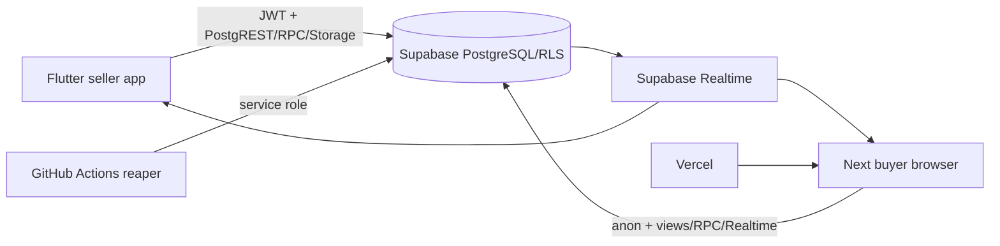
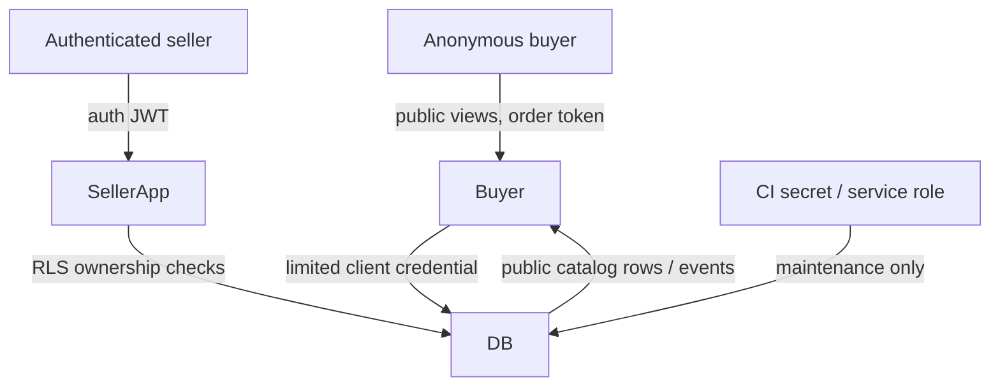

# 01 — Architecture reconciliation

**Confidence: PARTIALLY VERIFIED.** The actual implementation is a direct-client Supabase architecture: Flutter seller app and Next buyer app both use an anon key; seller mutations use RLS plus RPCs and the buyer calls four RPCs. No server-side web API, Edge Function, or server action was found.

Seller entry is `seller-app/lib/main.dart`; auth configuration and session state are in `core/services/supabase_service.dart`; repository operations are in `data/repositories/seller_repository.dart`. Buyer App Router pages are `src/app/{page,shop,drop/[slug],cart,checkout,order}` and data access is `src/lib/data/buyer-catalog.ts`. Public catalog uses `public_seller_storefronts` and `public_products_catalog`; checkout uses `create_order_with_reservation`, `initiate_payment_attempt`, `submit_buyer_payment_claim`, and `get_order_by_token`.

The separate `Final Buyer website design/livedrop-ui-v1/` contains a second web application and is not part of the CI/deploy paths. Its release status must be made explicit.
