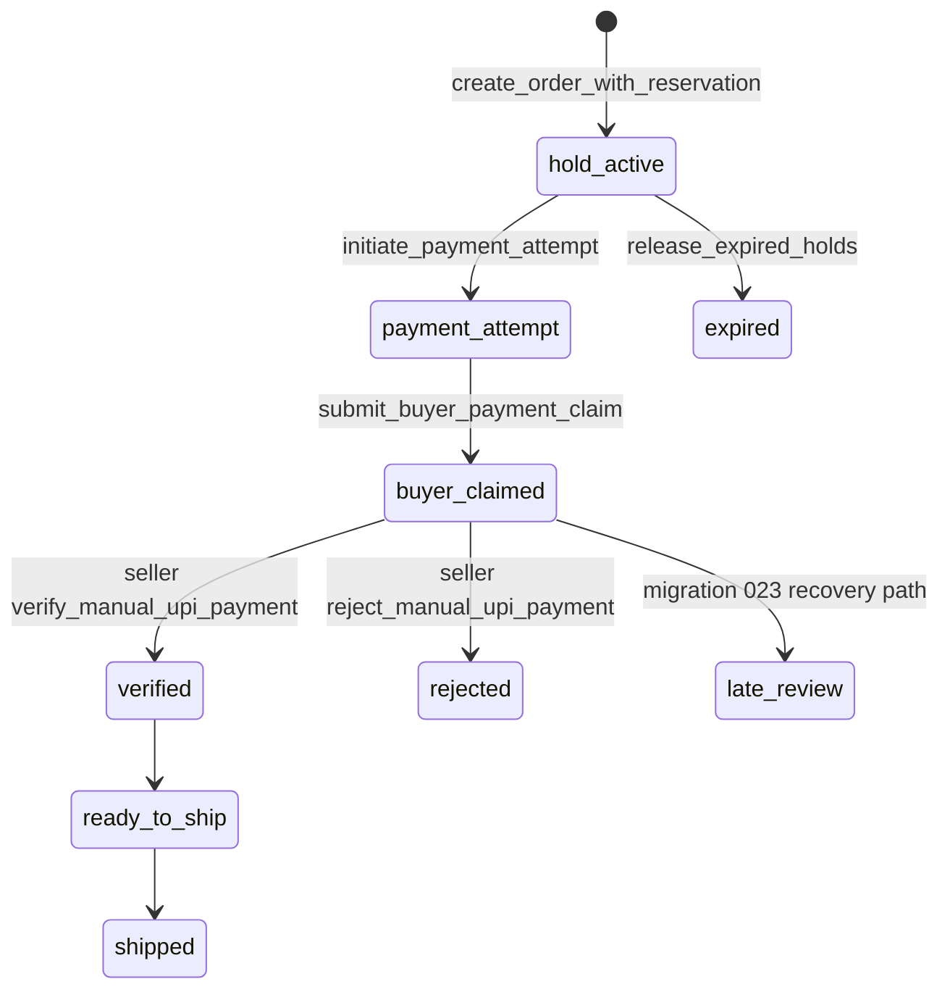

# 05 — Payment pipeline audit

**Confidence: PARTIALLY VERIFIED.** This is direct UPI/manual verification, not a gateway or webhook payment system. Buyer creates an attempt, receives payee data/UPI URI, submits a UTR claim, and the owning seller invokes `verify_manual_upi_payment`; rejection uses `reject_manual_upi_payment`. Verified ledger support is represented by `record_verified_payment`, restricted to service role in migrations. No provider webhook, authenticity validation, refund engine, or reconciliation integration was found.

Answers from static code: (1) verification occurs only through seller/manual verification logic; (2) drop-owning authenticated seller or service role is the intended mutator; (3) payment attempts and `order_payments` form the audit boundary; (4) a seller can falsely assert payment in this manual model—there is no bank-side proof; (5) buyer cannot directly set verified status by intended grants/triggers; (6) UTR duplicate prevention is implemented in the claim/verification migrations but unverified at runtime; (7–10) expiry, late claim, refresh, and retry paths are coded but unverified in a live database.

The manual model is launchable only with a documented seller review/reconciliation control and audit telemetry; neither is demonstrated. Payment and inventory races require staging proof before release.
